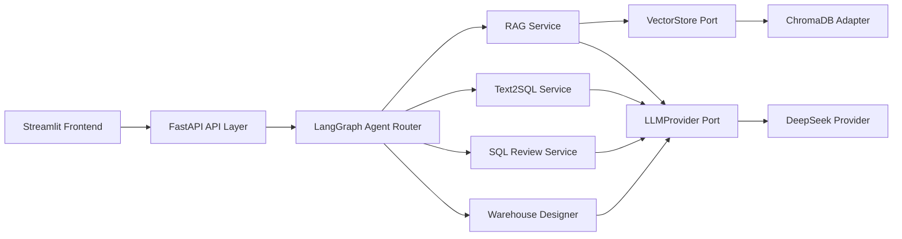

# DataPilot-AI

**AI Agent Platform for Data Engineering**

DataPilot-AI is a production-oriented AI agent platform for data engineering workflows. It combines knowledge-base RAG, Text2SQL, SQL review, warehouse design, and a LangGraph agent router behind a FastAPI backend and Streamlit UI.

The project is designed for GitHub publication, resume presentation, interview demonstrations, Docker deployment, and future extension to Spark, Hive, ClickHouse, Kafka, Flink, local LLMs, and GPU inference.

## Architecture Overview



The code follows Clean Architecture:

- Presentation: FastAPI routes, Pydantic API schemas, Streamlit pages.
- Application: RAG, Text2SQL, SQL Review, Warehouse Design, Agent graph.
- Domain: entities and provider ports.
- Infrastructure: ChromaDB, document loaders, embeddings, DeepSeek provider.

## Features

- Knowledge Base RAG for TXT, Markdown, PDF, and DOCX.
- ChromaDB vector storage with metadata filtering and persistence.
- DeepSeek async LLM provider with retries, timeouts, streaming, health checks, and usage tracking.
- Text2SQL generation for Hive, Spark SQL, MySQL, and ClickHouse.
- SQL review with risk scoring, rule checks, optimization suggestions, and LLM explanations.
- Warehouse design generation for ODS, DWD, DWS, ADS, DIM, fact tables, DDL, and metrics.
- LangGraph agent router for automatic intent classification and multi-step workflows.
- Streamlit UI for agent chat, knowledge base, Text2SQL, SQL review, and warehouse design.
- Docker Compose deployment with backend, frontend, ChromaDB, and optional Ollama profile.
- Integration tests and coverage gate.

## Screenshots

Place screenshots in `docs/assets/` before publishing:

- `docs/assets/agent-chat.png`
- `docs/assets/knowledge-base.png`
- `docs/assets/text2sql.png`
- `docs/assets/sql-review.png`
- `docs/assets/warehouse-design.png`

## Quick Start

```bash
scripts/bootstrap_venv.sh
.venv/bin/pip install -r backend/requirements.txt -r frontend/requirements.txt -r requirements-dev.txt
cp .env.example .env
```

Set `DEEPSEEK_API_KEY` in `.env`, then start the backend:

```bash
.venv/bin/uvicorn backend.app.main:app --host 0.0.0.0 --port 8000
```

Start the frontend:

```bash
BACKEND_URL=http://localhost:8000 .venv/bin/streamlit run frontend/app.py --server.port 8501
```

Open:

- API docs: `http://localhost:8000/docs`
- Streamlit UI: `http://localhost:8501`

## Docker Deployment

```bash
docker compose --env-file docker/.env.production config
docker compose --env-file docker/.env.production up -d
docker compose --env-file docker/.env.production logs -f
```

Optional Ollama profile:

```bash
docker compose --env-file docker/.env.production --profile ollama up -d
```

All runtime data is persisted under:

```text
./data
```

## Environment Variables

Key variables:

```text
DATACOPILOT_ENVIRONMENT=development|test|production
DATACOPILOT_DEBUG=false
DEEPSEEK_API_KEY=
DEEPSEEK_BASE_URL=https://api.deepseek.com/v1
DEEPSEEK_MODEL=deepseek-chat
BACKEND_URL=http://backend:8000
```

Typed settings are loaded through `pydantic-settings` from `.env.example` and `.env`.

## Project Structure

```text
backend/app/
  core/                 settings, constants, logging
  domain/               entities and provider ports
  application/          RAG, Text2SQL, SQL Review, Warehouse Design, Agent
  infrastructure/       ChromaDB, DeepSeek, document loaders, embeddings
  presentation/api/     FastAPI routes, schemas, dependencies
frontend/
  app.py
  pages/
  components/
  services/
tests/
  unit, API, infrastructure, integration, deployment tests
docker-compose.yml
docker/.env.production
docs/
```

## Tech Stack

- Python 3.12
- FastAPI, Pydantic v2, pydantic-settings
- LangGraph
- ChromaDB
- DeepSeek API via httpx
- Streamlit
- Docker Compose
- pytest, pytest-cov

## Testing

Run all tests:

```bash
.venv/bin/python -m pytest -v
```

Run coverage:

```bash
.venv/bin/python -m pytest --cov=backend --cov=frontend --cov-report=term-missing --cov-fail-under=85
```

Latest verified result:

```text
111 passed
Total coverage: 89.84%
```

## Future Plans

- Spark SQL execution integration.
- Hive metastore and lineage integration.
- ClickHouse schema introspection and query optimization.
- Kafka and Flink real-time data pipeline support.
- Local LLM and Ollama provider switching.
- GPU embedding and inference acceleration.
- Evaluation dashboards for SQL quality, RAG quality, and agent routing.

## Documentation

- [Architecture](docs/ARCHITECTURE.md)
- [Deployment](docs/DEPLOYMENT.md)
- [API Reference](docs/API_REFERENCE.md)
- [Interview Guide](docs/INTERVIEW_GUIDE.md)
- [Roadmap](docs/ROADMAP.md)
- [Changelog](docs/CHANGELOG.md)
- [Release Checklist](RELEASE_CHECKLIST.md)
