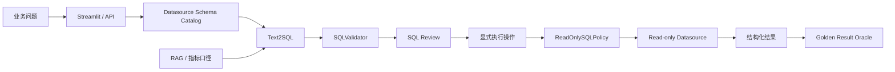

# DataPilot-AI

面向数据分析与数据工程场景的 **AI Application Copilot**。

DataPilot-AI 不把“接入一个大模型 API”当作项目完成。主链路围绕真实企业数据分析流程组织：

**企业知识 → 数据源 Schema 自动发现 → Text2SQL → 确定性安全校验 → SQL Review → 显式只读执行 → Golden Result 评测 → API / UI 交付**。

目标岗位：AI 应用开发、LLM Application Engineer、AI Backend Engineer。

## 解决什么问题

真实 Text2SQL 产品的难点不是“让模型吐出一段 SQL”，而是把业务语义、元数据、模型生成、安全治理、数据库权限和质量评测连成闭环：

1. 业务人员不知道表结构和指标口径；
2. 手工复制 DDL 到 Prompt 不可维护，Schema 变化后容易漂移；
3. LLM 可能引用不存在的表字段，或者生成危险 SQL；
4. SQL 语法正确、能够执行，并不代表业务答案正确；
5. 数据库读取本身也需要权限、超时、行数和审计边界；
6. 没有 benchmark，就无法回答模型质量、失败模式和回归风险。

项目因此把“生成能力”和“生产治理”分开设计：



> SQL 执行功能默认关闭。Schema 元数据读取和模型 SQL 执行是两个不同权限边界：即使执行关闭，应用仍可读取已配置数据源的非敏感 Schema 用于生成与审核。

## 核心能力

### 1. RAG 企业知识库

- TXT、Markdown、PDF、DOCX 文档摄取；
- BGE-M3 Embedding + ChromaDB 持久化；
- Dense + BM25 混合召回、RRF 融合和轻量重排；
- 引用返回与低相关度拒答；
- 指标口径、数据规范和业务定义可以作为 Text2SQL 的业务语义上下文；
- 文档 Registry 使用 SQLite 持久化，不把文档目录状态只放在进程内内存。

### 2. Datasource Schema 自动发现

项目引入独立 `SchemaCatalog` 领域端口。Text2SQL 支持两种输入模式：

- **Datasource 模式**：选择已配置数据源，服务端自动读取表结构并绑定 SQL Engine；
- **Manual Schema 模式**：用于 Hive/Spark/ClickHouse 等尚未配置在线 Catalog 的场景。

SQLite 演示适配器会从 `sqlite_schema` 生成确定性 Schema Snapshot，并返回 SHA-256 fingerprint。生成结果会携带：

- `schema_source`；
- `datasource`；
- `schema_fingerprint`；
- 发现的表数量。

这使问题可以从“复制 DDL 到文本框”升级为真正的：

**选择数据源 → 自动获取 Schema → 生成 SQL → 校验 → 执行**。

### 3. Text2SQL

- 支持 SQLite、MySQL、Hive、Spark SQL、ClickHouse；
- Prompt 显式注入 Schema、目标引擎和可选 RAG 上下文；
- JSON 结构化输出解析；
- 未知表、未知字段、JOIN、笛卡尔积、`SELECT *` 和引擎规则检查；
- 只接受单条 `SELECT/WITH`；
- 拒绝常见 DML、DDL、权限和管理语句；
- Datasource 模式自动校验请求引擎与数据源引擎一致性；
- 返回 SQL、解释、优化建议、置信度、校验结果、Token 用量和 Schema provenance。

### 4. SQL Review

- 确定性规则 + 可选 LLM 解释；
- 风险评分、规则问题和优化建议结构化输出；
- 可与 Text2SQL 组成“生成 → 校验 → 审核”多步骤流程；
- 核心安全判断不依赖 LLM 自评。

### 5. 受治理只读执行

独立 `QueryExecutor` 端口和 `QueryExecutionService`，不把数据库执行藏在 `Text2SQLService.execute=True` 之类的开关中。

当前 SQLite 适配器采用 defense-in-depth：

- 默认 `DATACOPILOT_QUERY_EXECUTION__ENABLED=false`；
- 只允许服务端配置的数据源名称，不接受客户端 DB URL/path；
- 执行前再次经过 `ReadOnlySQLPolicy`；
- 只允许单条 `SELECT/WITH`；
- 拒绝写入、DDL、管理语句、`PRAGMA`、extension/file loading 等入口；
- SQLite URI `mode=ro`；
- `PRAGMA query_only = ON`；
- 服务端最大返回行数；
- progress handler 查询 deadline；
- Query ID + actor + datasource + SQL SHA-256 + status + latency 审计。

应用层规则不能替代数据库原生权限。生产 MySQL/ClickHouse 必须继续使用专用只读账号、statement timeout、资源组/扫描量限制和 Secret Manager。

### 6. API Key + RBAC

可选 API Key 鉴权使用 `X-API-Key`，包含：

- `reader`：读取受保护 API 与 Schema 元数据；
- `analyst`：可显式执行受治理只读查询；
- `admin`：管理级权限。

密钥使用 constant-time compare。开发环境可关闭鉴权；生产部署应开启并从 Secret Store 注入。

当前是轻量 API-key RBAC，不把它包装成完整企业 IAM。真正多租户生产环境仍需要 OIDC/SSO、Workspace/Tenant 隔离和 tenant-scoped policy。

### 7. LangGraph Agent

- 显式意图识别和条件路由；
- RAG、Text2SQL、SQL Review、数仓设计、通用对话；
- `validate_result` 结果校验；
- 会话短期记忆、摘要压缩、最大执行步数和会话清理；
- 路由路径、工具调用和 Token 使用可观察。

数据库执行**没有**注册成 Agent Tool。即使是只读查询，它也会消耗真实数据库资源，因此保留为用户显式 API/UI 动作，而不是隐藏在自主 Agent 链路中。

### 8. Golden Result Text2SQL Benchmark

`examples/retail_analytics/questions.json` 为每个业务问题提供：

- 期望物理表；
- 结构特征；
- `golden_sql` 结果 Oracle。

Benchmark 会在同一个受治理只读数据源上分别执行生成 SQL 与 Golden SQL，并比较结果集，而不是把“SQL 执行成功”当作“业务回答正确”。核心指标包括：

- Generation Success Rate；
- Valid SQL Rate；
- Execution Attempt / Success Rate；
- Expected Table Recall；
- Schema Hallucination Rate；
- Result Oracle Coverage；
- Result Comparison Rate；
- **Business Result Accuracy**；
- Average / P95 Generation Latency；
- Execution Latency；
- Token Usage；
- Safety Policy Decision Accuracy；
- Unsafe Rejection Rate / Safe Acceptance Rate。

`business_result_accuracy` 按全部有 Oracle 的 case 计算，因此生成失败、校验失败和执行失败都会真实拉低端到端准确率，不只统计成功样本。

当前零售 Oracle 适合小型聚合查询：忽略行顺序和列别名，并对浮点数做有限容差。复杂生产查询应使用 case-specific oracle，而不是声称存在一个通用 SQL 等价判定器。

## 工程架构

```text
backend/app/
├── core/                 配置、日志、安全默认值
├── domain/               LLMProvider / VectorStore / QueryExecutor / SchemaCatalog
├── application/
│   ├── agent/
│   ├── rag/
│   ├── text2sql/
│   ├── sql_review/
│   ├── query_execution/  只读策略、执行服务、审计
│   └── evaluation/       Agent / Text2SQL / Safety / Golden Result metrics
├── infrastructure/
│   ├── llm/              DeepSeek / OpenAI / Ollama
│   ├── vectorstore/      ChromaDB
│   ├── embeddings/
│   ├── registry/         SQLite document registry
│   └── query_execution/  SQLite read-only executor + schema catalog
└── presentation/api/     FastAPI Route / Schema / DI / Security
```

工程措施：

- Ports & Adapters / Clean Architecture 风格隔离；
- Pydantic Settings 与 production safety validation；
- 外部 LLM timeout、有限 retry、health check；
- SSE 流式输出；
- request ID / trace ID / JSON logging；
- API key / RBAC；
- Schema provenance / fingerprint；
- 查询 timeout、row cap、read-only DB mode、audit；
- Docker Compose healthcheck 与 CPU/内存边界；
- GitHub Actions：compile、Compose validation、pytest、Coverage >= 85%；
- 可复现零售数据、Safety cases、Golden Result benchmark。

## 为什么主动删除微调和任务级多模型路由

本求职分支移除了：

- `training/` QLoRA / Unsloth 微调子系统；
- `RoutingLLMProvider` / `TaskBoundLLMProvider`；
- 任务级 local/cloud 路由；
- 与产品交付无关的生成式规划产物。

原因不是这些技术“没用”，而是它们没有证明对当前业务链路的收益，却增加了配置、测试和解释成本。AI Application Engineering 更应该优先证明：**业务闭环、安全边界、可评测性、部署和维护性**。

## 可复现零售经营分析

```text
examples/retail_analytics/
├── schema.sql
├── seed.sql
├── setup_demo_db.py
├── metric_definitions.md
├── questions.json             问题 + Golden SQL Oracle
├── safety_cases.json
├── run_demo.py
└── evaluate_text2sql.py       E2E + Safety benchmark
```

初始化：

```bash
python examples/retail_analytics/setup_demo_db.py --force
```

开启本地演示执行：

```text
DATACOPILOT_QUERY_EXECUTION__ENABLED=true
DATACOPILOT_QUERY_EXECUTION__DATASOURCE_NAME=retail_demo
DATACOPILOT_QUERY_EXECUTION__SQLITE_PATH=data/demo/retail_analytics.db
```

启动后，Streamlit Text2SQL 页面可直接选择 `retail_demo`，无需手工复制 Schema。

运行 benchmark：

```bash
python examples/retail_analytics/evaluate_text2sql.py
python examples/retail_analytics/evaluate_text2sql.py --use-rag
```

开启 API 鉴权后：

```bash
DATACOPILOT_API_KEY=<analyst-key> python examples/retail_analytics/evaluate_text2sql.py
```

报告默认写入 `data/evaluation/retail_text2sql_report.json`。README 不写未经真实运行得到的模型准确率；简历上的效果数字应来自固定模型、固定配置和保存的 benchmark 报告。

## 关键 API

```text
GET  /health
GET  /api/v1/auth/me
POST /api/v1/text2sql
GET  /api/v1/query-execution/datasources
GET  /api/v1/query-execution/datasources/{datasource}/schema
POST /api/v1/query-execution
```

Datasource Text2SQL 示例：

```json
{
  "question": "统计最近30天各区域GMV",
  "datasource": "retail_demo",
  "use_rag": true
}
```

服务端自动发现 Schema 与 SQL Engine。`datasource` 与 `schema_context` 互斥，防止请求同时提供两份可能冲突的元数据。

## 快速开始

```bash
conda env create -f environment.yml
conda activate datacopilot
cp .env.example .env
```

配置至少一个模型，例如：

```text
DEEPSEEK_API_KEY=你的密钥
```

启动：

```bash
python manage.py start --no-open
```

默认访问：

- Streamlit：`http://127.0.0.1:8502`
- FastAPI Docs：`http://127.0.0.1:8000/docs`
- Health：`http://127.0.0.1:8000/health`

## Docker

```bash
docker compose --env-file docker/.env.production config --quiet
docker compose --env-file docker/.env.production up -d --build
```

生产默认保持 SQL 执行关闭，再由部署环境显式授权需要的能力。

## 测试与质量门禁

```bash
python -m compileall -q backend frontend examples/retail_analytics
docker compose --env-file docker/.env.production config --quiet
python -m pytest -q --cov=backend --cov=frontend --cov-report=term-missing --cov-fail-under=85
```

GitHub Actions 对 PR 执行同类门禁。模型效果指标与代码覆盖率分开治理：coverage 证明代码路径被测试，不代表 LLM 质量。

## 主要技术栈

- Python 3.12
- FastAPI / Pydantic v2 / pydantic-settings
- LangGraph / LangChain Core
- ChromaDB / BGE-M3
- DeepSeek / OpenAI / Ollama / httpx
- SQLite（可复现 Registry、Schema Catalog、只读执行 Demo）
- Streamlit
- Docker Compose
- pytest / pytest-cov / GitHub Actions

## 后续成熟化优先级

1. **真正的多数据源 Registry**：MySQL / ClickHouse metadata + read-only adapter，凭据接 Secret Manager；
2. **企业身份与租户边界**：OIDC/SSO、Workspace/Tenant 隔离、tenant-scoped RBAC 与审计；
3. **可观测性**：OpenTelemetry、LLM/Query span、P95/error-rate/token-cost dashboard；
4. **异步摄取**：任务队列、状态查询、幂等、失败重试和死信处理；
5. **分布式状态**：Redis/DB 会话状态、共享缓存和多实例部署；
6. **评测回归门禁**：更多 case-specific golden oracle、固定模型配置、阈值比较和 benchmark CI。

## 文档

- [系统架构](docs/ARCHITECTURE.md)
- [API 参考](docs/API_REFERENCE.md)
- [部署指南](docs/DEPLOYMENT.md)
- [面试讲解](docs/INTERVIEW_GUIDE.md)
- [路线图](docs/ROADMAP.md)
