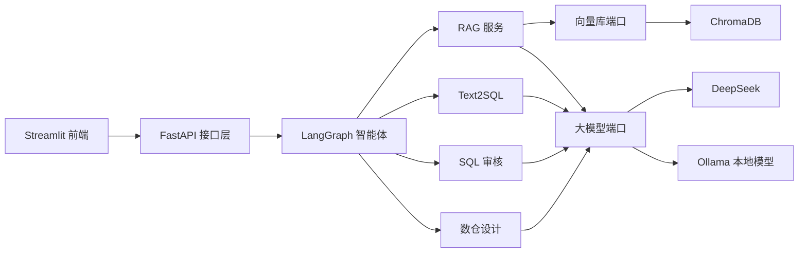

# DataPilot-AI

面向数据工程场景的 AI 智能体平台。

DataPilot-AI 将知识库 RAG、Text2SQL、SQL 审核、数仓设计和 LangGraph 智能体路由整合到同一个应用中，后端使用 FastAPI，前端使用 Streamlit，并支持 Docker 部署与本地模型。

启停方式、Docker 部署和访问地址请参阅 [START.md](START.md)。

## 系统架构



项目采用整洁架构：

- 表现层：FastAPI 路由、Pydantic 接口模型和 Streamlit 页面。
- 应用层：RAG、Text2SQL、SQL 审核、数仓设计和智能体工作流。
- 领域层：文档、分块实体以及大模型、向量库端口。
- 基础设施层：ChromaDB、DeepSeek、Ollama、文档加载器和 Embedding 实现。

## 主要功能

- 支持 TXT、Markdown、PDF 和 DOCX 的知识库 RAG。
- 使用 ChromaDB 持久化向量，支持元数据过滤。
- 默认采用稠密向量 + BM25 混合召回、RRF 融合和轻量重排。
- DeepSeek 异步调用，包含超时、有限重试、流式输出、健康检查和 Token 统计。
- 可切换到 Ollama 本地模型。
- 支持 Hive、Spark SQL、MySQL 和 ClickHouse 的 Text2SQL。
- SQL 风险评分、规则检查、性能建议和大模型解释。
- 生成 ODS、DWD、DWS、ADS、维度表、事实表、DDL 和指标定义。
- LangGraph 自动意图识别和多步骤工作流，含 `validate_result` 结果校验节点。
- LangChain 结构化工具与 Pydantic JSON Schema 参数校验。
- 会话短期记忆、摘要压缩、最大执行步数和会话清理。
- 多 LLM 智能路由：专业数据工程任务 → 本地微调模型，通用需求 → DeepSeek/OpenAI 云端，本地故障自动降级。
- 模型微调子系统（`training/`）：基于公开数据集构建 3200+ 条数据工程 SFT 指令集，Unsloth 4-bit QLoRA 微调 Qwen3-8B，基座/微调对比评测，GGUF 导出与 Ollama 私有化部署。
- 后端、前端、ChromaDB 和可选 Ollama 的 Docker Compose 部署。
- 单元、接口、基础设施和集成测试。

## 快速开始

Windows 推荐直接使用：

```bat
start.cmd
```

也可以使用 Conda 环境：

```bash
conda env create -f environment.yml
conda activate datacopilot
python manage.py start --no-open
```

配置文件为 `.env`，可参考 `.env.example`。默认大模型为 DeepSeek，需要配置：

```text
DEEPSEEK_API_KEY=你的密钥
```

启动后访问：

- 工作台：`http://127.0.0.1:8502`
- API 文档：`http://127.0.0.1:8000/docs`
- 健康检查：`http://127.0.0.1:8000/health`

## Docker 部署

```bash
docker compose --env-file docker/.env.production up -d --build
docker compose --env-file docker/.env.production logs -f
```

启用 Ollama：

```bash
docker compose --profile ollama up -d ollama
docker compose exec ollama ollama pull qwen3
```

然后设置 `LLM_PROVIDER=ollama`、`OLLAMA_ENABLED=true` 和 `OLLAMA_MODEL=qwen3` 后重新启动。运行数据统一保存在 `data/` 目录。

## 关键环境变量

```text
DATACOPILOT_ENVIRONMENT=development|test|production
DATACOPILOT_DEBUG=false
DATACOPILOT_LLM__DEFAULT_PROVIDER=deepseek|ollama
DATACOPILOT_LLM__ROUTING_ENABLED=false
DATACOPILOT_LLM__CLOUD_PROVIDER=deepseek
DEEPSEEK_API_KEY=
DEEPSEEK_BASE_URL=https://api.deepseek.com/v1
DEEPSEEK_MODEL=deepseek-chat
DATACOPILOT_OLLAMA__BASE_URL=http://127.0.0.1:11434
DATACOPILOT_OLLAMA__CHAT_MODEL=qwen3
DATACOPILOT_LOCAL__ENABLED=false
DATACOPILOT_LOCAL__BASE_URL=http://127.0.0.1:11434/v1
DATACOPILOT_LOCAL__CHAT_MODEL=datacopilot-qwen3-8b
BACKEND_URL=http://backend:8000
```

## 项目结构

```text
backend/app/
  core/                 配置、常量和日志
  domain/               实体与端口
  application/          RAG、Text2SQL、SQL 审核、数仓设计、智能体、评测
  infrastructure/       ChromaDB、DeepSeek、Ollama、加载器、Embedding
  presentation/api/     FastAPI 路由、模型和依赖
frontend/               Streamlit 页面、组件和后端客户端
tests/                  单元、接口、基础设施和集成测试
docs/                   中文技术文档
```

## 技术栈

- Python 3.11+
- FastAPI、Pydantic v2、pydantic-settings
- LangGraph、LangChain Core
- ChromaDB、BGE-M3
- DeepSeek、Ollama、httpx
- Streamlit、Docker Compose
- pytest、pytest-cov

## 测试

```bash
python -m pytest -q
python -m pytest --cov=backend --cov=frontend --cov-report=term-missing
```

当前验证结果：`176 passed`。

## 文档

- [技术栈说明](docs/AGENT_TECH_STACK.md)
- [系统架构](docs/ARCHITECTURE.md)
- [接口参考](docs/API_REFERENCE.md)
- [部署指南](docs/DEPLOYMENT.md)
- [面试讲解](docs/INTERVIEW_GUIDE.md)
- [路线图](docs/ROADMAP.md)
- [变更记录](docs/CHANGELOG.md)
- [发布检查清单](RELEASE_CHECKLIST.md)
