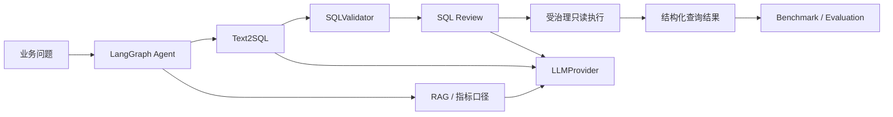

# DataPilot-AI

面向数据分析与数据工程场景的 **AI Application Copilot**。

DataPilot-AI 不把“接了大模型 API”当作完成。项目围绕一条可验证的应用链路组织：

**企业知识检索 → Text2SQL → 确定性安全校验 → SQL 审核 → 受治理只读执行 → 可量化评测 → API / UI 交付**。

目标岗位：AI 应用开发、LLM Application Engineer、AI Backend Engineer。

## 解决什么问题

数据团队的常见瓶颈不是缺少聊天框，而是业务知识、SQL 生成和数据库治理彼此割裂：

1. 业务人员不知道表结构、指标口径和数据规范；
2. 数据人员反复把自然语言需求翻译成 SQL；
3. LLM 生成 SQL 即使语法正确，也可能引用不存在的表字段或产生高风险语句；
4. 只做“生成 SQL”的 Demo 无法证明查询真正能执行；
5. 没有 benchmark 时，项目很难回答“质量如何、成本如何、失败在哪里”。

DataPilot-AI 将这些问题串成一个工程闭环：



> 查询执行功能**默认关闭**。内置 SQLite 适配器用于可复现本地演示；接入生产 MySQL、ClickHouse 等数据库时仍必须使用独立只读账号、Secret 管理和数据库原生资源治理。

## 核心能力

### 1. RAG 企业知识库

- TXT、Markdown、PDF、DOCX 文档摄取；
- BGE-M3 Embedding + ChromaDB 持久化；
- Dense + BM25 混合召回、RRF 融合和轻量重排；
- 引用返回与低相关度拒答；
- 指标口径、表说明、数据规范可以作为 Text2SQL 的业务上下文。

### 2. Text2SQL

- 支持 SQLite、MySQL、Hive、Spark SQL、ClickHouse；
- Prompt 显式注入 Schema、目标引擎和可选 RAG 上下文；
- JSON 结构化解析；
- 检查未知表、未知字段、JOIN、`SELECT *` 和引擎特定风险；
- 只接受单条 `SELECT/WITH`；
- 拒绝常见 DML、DDL、权限和管理语句；
- 返回 SQL、解释、优化建议、置信度、校验结果和 Token 用量。

### 3. SQL Review

- 确定性规则 + 可选 LLM 解释；
- 风险评分、规则问题和优化建议结构化输出；
- 可以和 Text2SQL 组成“生成 → 校验 → 审核”多步骤流程。

### 4. 受治理的只读查询执行

新增独立 `QueryExecutor` 领域端口和 `QueryExecutionService`，执行能力不直接耦合 Text2SQL。

当前 SQLite 适配器采用多层防护：

- 执行能力默认 `enabled=false`；
- 只允许配置中的白名单数据源；
- 应用层再次执行 `ReadOnlySQLPolicy`；
- 只允许单条 `SELECT/WITH`；
- 拒绝写入、DDL、管理语句、`PRAGMA`、extension/file loading 等危险入口；
- SQLite 使用 URI `mode=ro`；
- 连接启用 `PRAGMA query_only = ON`；
- 服务端强制最大返回行数；
- SQLite progress handler 实现执行 deadline；
- 审计记录 Query ID、数据源、SQL SHA-256、状态、行数和耗时，不把原始 SQL/凭据写入结构化审计字段。

这是一条 **defense-in-depth** 边界：应用层字符串策略不能替代数据库只读权限。

### 5. LangGraph Agent

- 显式意图识别和条件路由；
- RAG、Text2SQL、SQL Review、数仓设计、通用对话；
- `validate_result` 结果校验节点；
- 会话短期记忆、摘要压缩、最大执行步数和会话清理；
- 路由路径与工具调用可测试、可观测。

> 当前不让 Agent 自动触发数据库执行。执行动作保留为显式 API/UI 操作，避免把高风险副作用隐藏在自主 Agent 链路中。

### 6. 可量化 Benchmark

`backend/app/application/evaluation/` 与 `examples/retail_analytics/evaluate_text2sql.py` 将质量拆成独立指标：

- Generation Success Rate；
- Valid SQL Rate；
- Execution Attempt / Success Rate；
- Expected Table Recall；
- Schema Hallucination Rate；
- Average / P95 Generation Latency；
- Execution Latency；
- Total / Average Token Usage；
- Safety Policy Decision Accuracy；
- Unsafe Rejection Rate；
- Safe Acceptance Rate。

**Execution Success 不等于业务结果正确率。** 在没有 golden result / oracle 之前，项目不会把“SQL 能运行”包装成“业务答案准确”。这也是评测报告中的明确说明。

## 工程化架构

```text
backend/app/
├── core/                 配置、日志、运行时治理
├── domain/               LLM / VectorStore / QueryExecutor 端口
├── application/
│   ├── agent/
│   ├── rag/
│   ├── text2sql/
│   ├── sql_review/
│   ├── query_execution/  只读策略、执行服务、审计
│   └── evaluation/       Agent / Text2SQL / Safety benchmark
├── infrastructure/
│   ├── llm/              DeepSeek / OpenAI / Ollama
│   ├── vectorstore/      ChromaDB
│   ├── embeddings/
│   └── query_execution/  SQLiteReadOnlyExecutor
└── presentation/api/     FastAPI Route / Schema / DI
```

工程措施：

- Clean Architecture 风格的端口/适配器隔离；
- Pydantic Settings 和安全默认值；
- 外部 LLM 超时、有限重试、健康检查；
- SSE 流式输出；
- request ID / trace ID / JSON 日志；
- 查询执行超时、行数上限、审计；
- Docker Compose 健康检查和 CPU/内存边界；
- GitHub Actions：Python compile、Compose config、pytest、Coverage >= 85%；
- 可复现业务数据集和 benchmark，而不是只依赖在线模型的人工截图。

## 为什么主动删除微调和任务级多模型路由

本求职分支移除了：

- `training/` QLoRA / Unsloth 微调子系统；
- `RoutingLLMProvider` / `TaskBoundLLMProvider`；
- 任务级 local/cloud 路由配置；
- 与产品交付无关的生成式规划产物。

原因：**AI Application Engineering 的核心不是组件数量，而是业务闭环、安全边界、评测、部署、可维护性。** 模型训练可以作为独立 Model Engineering 项目，不应为了“技术栈丰富”侵入应用主链路。

## 可复现零售经营分析场景

```text
examples/retail_analytics/
├── schema.sql                 订单/客户/商品/退款 Schema
├── seed.sql                   演示数据
├── setup_demo_db.py           构建本地 SQLite 数据库
├── metric_definitions.md      GMV、退款率、客单价等业务口径
├── questions.json             Text2SQL benchmark 问题集
├── safety_cases.json          只读安全决策测试集
├── run_demo.py                生成 + 可选执行演示
└── evaluate_text2sql.py       生成 benchmark JSON 报告
```

初始化数据库：

```bash
python examples/retail_analytics/setup_demo_db.py --force
```

`.env` 中显式开启**本地演示**执行能力：

```text
DATACOPILOT_QUERY_EXECUTION__ENABLED=true
DATACOPILOT_QUERY_EXECUTION__DATASOURCE_NAME=retail_demo
DATACOPILOT_QUERY_EXECUTION__SQLITE_PATH=data/demo/retail_analytics.db
```

然后运行：

```bash
python examples/retail_analytics/run_demo.py
python examples/retail_analytics/evaluate_text2sql.py
```

Benchmark 报告默认写入：

```text
data/evaluation/retail_text2sql_report.json
```

如要验证 RAG 对指标口径的影响，可先摄取 `metric_definitions.md`，再执行：

```bash
python examples/retail_analytics/evaluate_text2sql.py --use-rag
```

## API 中的执行边界

```text
GET  /api/v1/query-execution/datasources
POST /api/v1/query-execution
```

前端 Text2SQL 页面只有在以下条件全部满足时才显示可执行操作：

1. 生成 SQL 已通过静态校验；
2. 后端执行能力显式启用；
3. 白名单数据源可用。

即使前端允许点击，后端仍会重新执行只读策略和资源限制。

## 快速开始

```bash
conda env create -f environment.yml
conda activate datacopilot
cp .env.example .env
```

至少配置一个可用模型，例如：

```text
DEEPSEEK_API_KEY=你的密钥
```

启动：

```bash
python manage.py start --no-open
```

Windows 也可使用：

```bat
start.cmd
```

默认访问：

- Streamlit：`http://127.0.0.1:8502`
- FastAPI Docs：`http://127.0.0.1:8000/docs`
- Health：`http://127.0.0.1:8000/health`

## Docker

```bash
docker compose --env-file docker/.env.production config --quiet
docker compose --env-file docker/.env.production up -d --build
```

生产默认配置保持：

```text
DATACOPILOT_QUERY_EXECUTION__ENABLED=false
```

本地 Ollama 可通过 Compose profile 启用；模型选择只发生在组合根，不侵入 RAG/Text2SQL 业务代码。

## 测试与质量门禁

```bash
python -m compileall -q backend frontend examples/retail_analytics
docker compose --env-file docker/.env.production config --quiet
python -m pytest -q --cov=backend --cov=frontend --cov-report=term-missing --cov-fail-under=85
```

GitHub Actions 对 PR 执行同类门禁。简历和面试中的模型效果数据应来自实际 benchmark 报告，不在 README 中写未经运行验证的准确率。

## 主要技术栈

- Python 3.12
- FastAPI / Pydantic v2 / pydantic-settings
- LangGraph / LangChain Core
- ChromaDB / BGE-M3
- DeepSeek / OpenAI / Ollama / httpx
- SQLite（可复现只读执行 Demo）
- Streamlit
- Docker Compose
- pytest / pytest-cov / GitHub Actions

## 文档

- [系统架构](docs/ARCHITECTURE.md)
- [API 参考](docs/API_REFERENCE.md)
- [部署指南](docs/DEPLOYMENT.md)
- [面试讲解](docs/INTERVIEW_GUIDE.md)
- [路线图](docs/ROADMAP.md)

## 后续成熟化优先级

1. 数据源 Registry + MySQL / ClickHouse **只读账号适配器**，凭据接入 Secret Manager；
2. golden SQL / golden result oracle，增加真正的业务结果正确率；
3. API 鉴权、Workspace / Tenant 隔离、RBAC；
4. OpenTelemetry + LLM tracing + P95 / error-rate / token-cost dashboard；
5. 文档摄取异步任务队列、任务状态和失败重试；
6. 将进程内会话/文档 Registry 替换为 Redis / DB 持久化。
