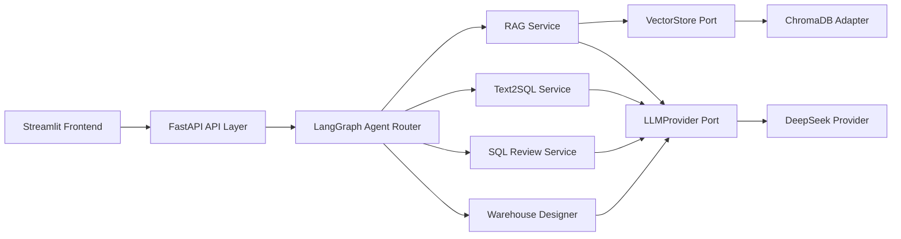

# DataPilot-AI

**AI Agent Platform for Data Engineering**

DataPilot-AI is a production-oriented AI agent platform for data engineering workflows. It combines knowledge-base RAG, Text2SQL, SQL review, warehouse design, and a LangGraph agent router behind a FastAPI backend and Streamlit UI.

The project is designed for GitHub publication, resume presentation, interview demonstrations, Docker deployment, and future extension to Spark, Hive, ClickHouse, Kafka, Flink, local LLMs, and GPU inference.

## Architecture Overview



The code follows Clean Architecture:

- Presentation: FastAPI routes, Pydantic API schemas, Streamlit pages.
- Application: RAG, Text2SQL, SQL Review, Warehouse Design, Agent graph.
- Domain: entities and provider ports.
- Infrastructure: ChromaDB, document loaders, embeddings, DeepSeek provider.

## Features

- Knowledge Base RAG for TXT, Markdown, PDF, and DOCX.
- ChromaDB vector storage with metadata filtering and persistence.
- DeepSeek async LLM provider with retries, timeouts, streaming, health checks, and usage tracking.
- Text2SQL generation for Hive, Spark SQL, MySQL, and ClickHouse.
- SQL review with risk scoring, rule checks, optimization suggestions, and LLM explanations.
- Warehouse design generation for ODS, DWD, DWS, ADS, DIM, fact tables, DDL, and metrics.
- LangGraph agent router for automatic intent classification and multi-step workflows.
- Streamlit UI for agent chat, knowledge base, Text2SQL, SQL review, and warehouse design.
- Docker Compose deployment with backend, frontend, ChromaDB, and optional Ollama profile.
- Integration tests and coverage gate.

## Screenshots

Place screenshots in `docs/assets/` before publishing:

- `docs/assets/agent-chat.png`
- `docs/assets/knowledge-base.png`
- `docs/assets/text2sql.png`
- `docs/assets/sql-review.png`
- `docs/assets/warehouse-design.png`

## Quick Start

### Windows 一键启动

在项目根目录执行（不受 PowerShell 执行策略限制）：

```text
.\start.bat
```

也可以直接双击 `start.bat`。脚本会使用 `D:\Anaconda\Miniconda3`，在项目根目录创建 `.conda`（Python 3.11），安装后端/前端/测试依赖、复制 `.env.example` 为 `.env`，并同时启动 FastAPI 与 Streamlit。停止服务：

```text
.\stop.bat
```

如果系统允许执行 PowerShell 脚本，也可以使用 `.\start.ps1` 和 `.\stop.ps1`。Conda 环境、pip/conda 缓存和运行数据都保存在项目根目录，不依赖系统 Python。

首次启动后，请在 `.env` 中填写 `DEEPSEEK_API_KEY`，否则页面仍可打开，但需要模型的功能会返回降级状态。

### Linux / macOS 一键启动

```bash
scripts/bootstrap_venv.sh
scripts/dev.sh
```

停止：`scripts/stop-dev.sh`。

```bash
scripts/bootstrap_venv.sh
cp .env.example .env
```

Set `DEEPSEEK_API_KEY` in `.env`, then start the backend:

```bash
.venv/bin/uvicorn backend.app.main:app --host 0.0.0.0 --port 8000
```

Start the frontend:

```bash
BACKEND_URL=http://localhost:8000 .venv/bin/streamlit run frontend/app.py --server.port 8501
```

Open:

- API docs: `http://localhost:8000/docs`
- Streamlit UI: `http://localhost:8501`

## Vercel 公网部署

项目已提供 `index.py`、`vercel.json` 和 `public/index.html`。部署到 Vercel 后，同一个公网域名会提供：

- 轻量 Web 控制台：`https://<项目名>.vercel.app/`
- FastAPI 健康检查：`https://<项目名>.vercel.app/health`
- Swagger API 文档：`https://<项目名>.vercel.app/docs`
- OpenAPI：`https://<项目名>.vercel.app/openapi.json`

使用已登录的 Vercel CLI 部署：

```powershell
vercel.cmd link
vercel.cmd env add DEEPSEEK_API_KEY production
vercel.cmd env add DEEPSEEK_BASE_URL production
vercel.cmd deploy --prod
```

其中 `DEEPSEEK_API_KEY` 必须填写真实密钥；`DEEPSEEK_BASE_URL` 可使用默认值 `https://api.deepseek.com/v1`。Vercel Serverless 的本地文件只在实例生命周期内保留，知识库数据不适合依赖它做长期持久化；需要稳定知识库时请使用 Docker Compose + 持久磁盘，或将 ChromaDB 换成外部向量数据库。

Vercel 控制台与 Docker Streamlit 是两套入口：Vercel 适合外网 API/演示，完整多页面 Streamlit 适合本地或 Docker 长驻运行。

本地数据路径约定：所有运行数据都在项目根目录 `data/`，配置文件是根目录 `.env`，虚拟环境是根目录 `.venv/`；启动脚本不会把这些内容写到 C 盘其他位置。只有 Vercel 云端函数因平台只读限制使用云端临时 `/tmp`，不会影响本地项目目录。

## Docker Deployment

```bash
docker compose --env-file docker/.env.production config
docker compose --env-file docker/.env.production up -d
docker compose --env-file docker/.env.production logs -f
```

Optional Ollama profile:

```bash
docker compose --env-file docker/.env.production --profile ollama up -d
```

All runtime data is persisted under:

```text
./data
```

## Environment Variables

Key variables:

```text
DATACOPILOT_ENVIRONMENT=development|test|production
DATACOPILOT_DEBUG=false
DEEPSEEK_API_KEY=
DEEPSEEK_BASE_URL=https://api.deepseek.com/v1
DEEPSEEK_MODEL=deepseek-chat
BACKEND_URL=http://backend:8000
```

Typed settings are loaded through `pydantic-settings` from `.env.example` and `.env`.

## Project Structure

```text
backend/app/
  core/                 settings, constants, logging
  domain/               entities and provider ports
  application/          RAG, Text2SQL, SQL Review, Warehouse Design, Agent
  infrastructure/       ChromaDB, DeepSeek, document loaders, embeddings
  presentation/api/     FastAPI routes, schemas, dependencies
frontend/
  app.py
  pages/
  components/
  services/
tests/
  unit, API, infrastructure, integration, deployment tests
docker-compose.yml
docker/.env.production
docs/
```

## Tech Stack

- Python 3.12
- FastAPI, Pydantic v2, pydantic-settings
- LangGraph
- ChromaDB
- DeepSeek API via httpx
- Streamlit
- Docker Compose
- pytest, pytest-cov

## Testing

Run all tests:

```bash
.venv/bin/python -m pytest -v
```

Run coverage:

```bash
.venv/bin/python -m pytest --cov=backend --cov=frontend --cov-report=term-missing --cov-fail-under=85
```

Latest verified result:

```text
111 passed
Total coverage: 89.84%
```

## Future Plans

- Spark SQL execution integration.
- Hive metastore and lineage integration.
- ClickHouse schema introspection and query optimization.
- Kafka and Flink real-time data pipeline support.
- Local LLM and Ollama provider switching.
- GPU embedding and inference acceleration.
- Evaluation dashboards for SQL quality, RAG quality, and agent routing.

## Documentation

- [Architecture](docs/ARCHITECTURE.md)
- [Deployment](docs/DEPLOYMENT.md)
- [API Reference](docs/API_REFERENCE.md)
- [Interview Guide](docs/INTERVIEW_GUIDE.md)
- [Roadmap](docs/ROADMAP.md)
- [Changelog](docs/CHANGELOG.md)
- [Release Checklist](RELEASE_CHECKLIST.md)
