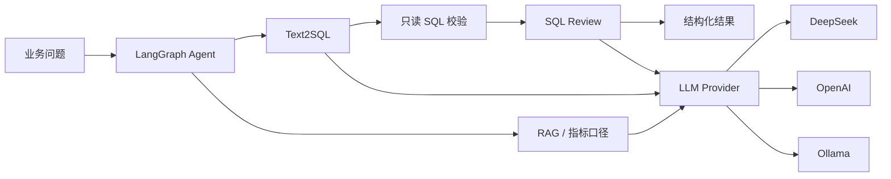

# DataPilot-AI

面向数据分析与数据工程场景的 **AI Application Copilot**。

DataPilot-AI 不是单纯的聊天壳，也不以堆模型为目标。项目围绕一个可落地的主链路组织：**企业知识检索 → 自然语言生成 SQL → 确定性安全校验 → SQL 审核 → LangGraph 工作流编排 → 可观测 API/前端交互**。

适合作为 AI 应用开发、LLM Application Engineer、AI Backend Engineer 等岗位的工程实践项目。

## 解决什么问题

真实数据团队经常遇到两类重复工作：

1. 业务人员不知道表结构和指标口径，需要反复询问数据同学；
2. 数据同学需要把自然语言需求翻译成 SQL，并检查字段、JOIN、性能和风险。

DataPilot-AI 将这些步骤串成统一应用：



项目默认**不直接对生产数据库执行模型生成 SQL**。这是刻意保留的安全边界：生成和审核负责给出可信查询，真正接入生产执行层时仍需要只读账号、查询超时、资源限制和审计。

## 核心能力

### RAG 企业知识库

- 支持 TXT、Markdown、PDF、DOCX 文档摄取；
- BGE-M3 Embedding + ChromaDB 持久化；
- 稠密向量与 BM25 混合召回、RRF 融合和轻量重排；
- 返回引用信息，便于检查答案来源；
- 可把指标口径、表说明、数据规范作为 Text2SQL 上下文。

### Text2SQL

- 支持 MySQL、Hive、Spark SQL、ClickHouse；
- Prompt 中显式注入 Schema、目标引擎和业务知识；
- 对模型 JSON 输出做结构化解析；
- 校验未知表、未知字段、`SELECT *`、JOIN 条件和引擎特定风险；
- 只允许单条 `SELECT/WITH` 查询，拒绝 `INSERT/UPDATE/DELETE/DROP/ALTER/TRUNCATE/MERGE/GRANT/...` 等写入或管理语句；
- 输出 SQL、解释、优化建议、置信度和校验结果。

### SQL Review

- 确定性规则与 LLM 解释结合；
- 风险评分、规则问题、性能建议结构化输出；
- 与 Text2SQL 组合，可构成“生成 → 校验 → 审核”的完整流程。

### LangGraph Agent

- 显式意图识别与条件路由；
- 支持 RAG、Text2SQL、SQL Review、数仓设计和通用对话；
- `validate_result` 节点负责结果校验；
- 会话短期记忆、摘要压缩、最大执行步数和会话清理；
- 路由路径和工具使用可以被测试，而不是只依赖不可观测的单 Prompt Agent。

## 工程化设计

后端采用类似 Clean Architecture 的分层：

```text
backend/app/
├── core/                 配置、常量、日志
├── domain/               实体与 LLM / VectorStore 端口
├── application/          Agent、RAG、Text2SQL、SQL Review、Evaluation
├── infrastructure/       DeepSeek/OpenAI/Ollama、ChromaDB、Embedding、文档加载
└── presentation/api/     FastAPI 路由、Schema、依赖注入
```

关键工程措施：

- **Provider 解耦**：业务服务只依赖统一 `LLMProvider`，模型选择只发生在应用组合根；
- **有限重试和超时**：外部模型调用不做无限重试；
- **流式输出**：支持 SSE/流式模型响应；
- **配置隔离**：Pydantic Settings + `.env`，密钥不写入仓库；
- **结构化日志**：请求耗时、request/trace header 和日志轮转；
- **容器化**：FastAPI、Streamlit、ChromaDB 和可选 Ollama 使用 Docker Compose；
- **资源边界**：Compose 为主要服务设置 CPU/内存限制和健康检查；
- **测试门禁**：GitHub Actions 执行 pytest 与 coverage gate，覆盖率阈值为 85%。

## 为什么删除了部分“看起来高级”的组件

本分支针对 AI 应用开发岗位做了主动收敛：

- 移除独立 `training/` 微调子系统；
- 移除 `RoutingLLMProvider` / `TaskBoundLLMProvider` 任务级模型路由；
- 保留 DeepSeek、OpenAI、Ollama 三种明确的运行时 provider；
- 删除与最终产品无关的生成式规划文档。

原因很简单：对于一个 AI 应用项目，**可验证的业务闭环、安全、评测、部署和维护成本**比“同时存在多少模型组件”更重要。微调属于 Model Engineering，可以作为独立项目，而不是强行和应用主仓库耦合。

## 可复现业务案例：零售经营分析

`examples/retail_analytics/` 提供完整演示材料：

```text
examples/retail_analytics/
├── schema.sql              订单/客户/商品/退款 Schema
├── metric_definitions.md   GMV、退款率、客单价等业务口径
├── questions.json          可重复执行的 Text2SQL 问题集
└── run_demo.py             调用后端 API 的演示脚本
```

示例问题：

- 最近 30 天各区域 GMV；
- 各获客渠道客单价；
- 商品品类销售额 Top10；
- 最近 30 天退款率；
- 退款金额最高的区域。

启动后端后运行：

```bash
python examples/retail_analytics/run_demo.py
```

把 `metric_definitions.md` 上传知识库并设置 `use_rag=true`，即可演示“业务指标口径 RAG + Text2SQL”的组合能力。

## 快速开始

### Conda

```bash
conda env create -f environment.yml
conda activate datacopilot
cp .env.example .env
```

在 `.env` 中至少配置：

```text
DEEPSEEK_API_KEY=你的密钥
```

启动：

```bash
python manage.py start --no-open
```

也可以在 Windows 使用：

```bat
start.cmd
```

默认访问地址：

- Streamlit：`http://127.0.0.1:8502`
- FastAPI Docs：`http://127.0.0.1:8000/docs`
- Health：`http://127.0.0.1:8000/health`

## Docker

```bash
docker compose --env-file docker/.env.production config --quiet
docker compose --env-file docker/.env.production up -d --build
docker compose --env-file docker/.env.production logs -f
```

可选本地 Ollama：

```bash
docker compose --profile ollama up -d ollama
docker compose exec ollama ollama pull qwen3
```

然后设置：

```text
LLM_PROVIDER=ollama
OLLAMA_ENABLED=true
OLLAMA_MODEL=qwen3
```

## 测试与评测

运行全量测试：

```bash
python -m pytest -q
```

覆盖率门禁：

```bash
python -m pytest --cov=backend --cov=frontend --cov-report=term-missing --cov-fail-under=85
```

离线业务问题集见：

```text
examples/retail_analytics/questions.json
```

项目中的 `application/evaluation/` 用于承载 RAG/Text2SQL/Agent 的可量化评测逻辑。实际简历或面试中应只展示你真实跑出的指标，不在 README 中虚构准确率。

## 主要技术栈

- Python 3.11+
- FastAPI / Pydantic v2 / pydantic-settings
- LangGraph / LangChain Core
- ChromaDB / BGE-M3
- DeepSeek / OpenAI / Ollama / httpx
- Streamlit
- Docker Compose
- pytest / pytest-cov / GitHub Actions

## 文档

- [系统架构](docs/ARCHITECTURE.md)
- [API 参考](docs/API_REFERENCE.md)
- [部署指南](docs/DEPLOYMENT.md)
- [面试讲解](docs/INTERVIEW_GUIDE.md)
- [路线图](docs/ROADMAP.md)
- [变更记录](docs/CHANGELOG.md)

## 下一步适合继续做什么

优先级建议：

1. 增加真实数据库的**只读执行适配器**，带 statement timeout、最大返回行数和审计；
2. 为 `questions.json` 增加 Execution Accuracy / Valid SQL Rate / Safety Reject Rate 的离线评测脚本；
3. 增加用户/工作区隔离和 RBAC；
4. 接入 OpenTelemetry 或 Langfuse/LangSmith 做 LLM trace；
5. 将 Streamlit 演示层替换为更完整的 Web UI（如果目标岗位偏全栈 AI 应用）。
