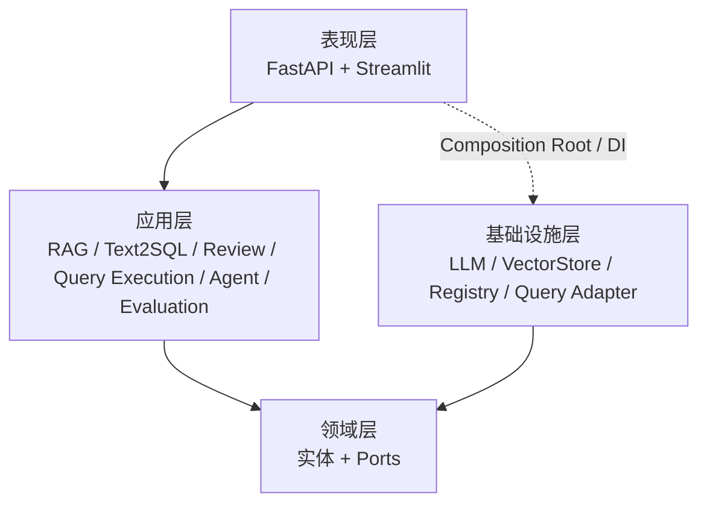
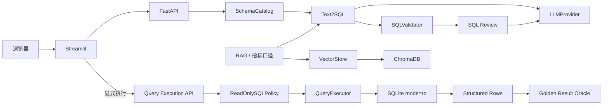
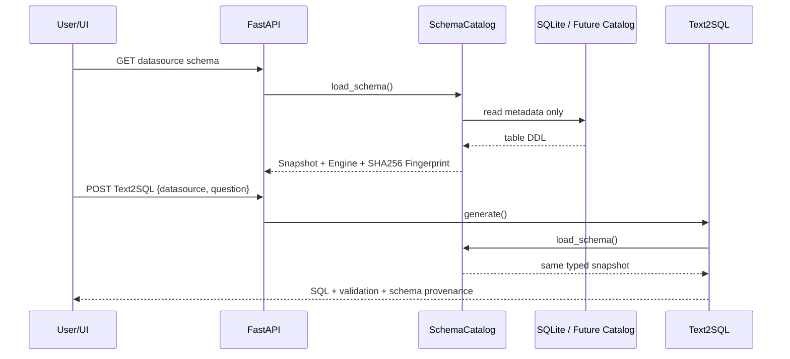
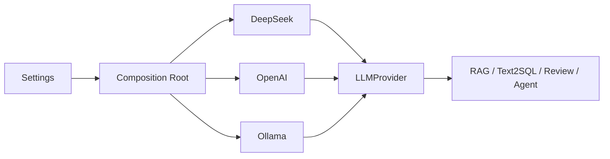
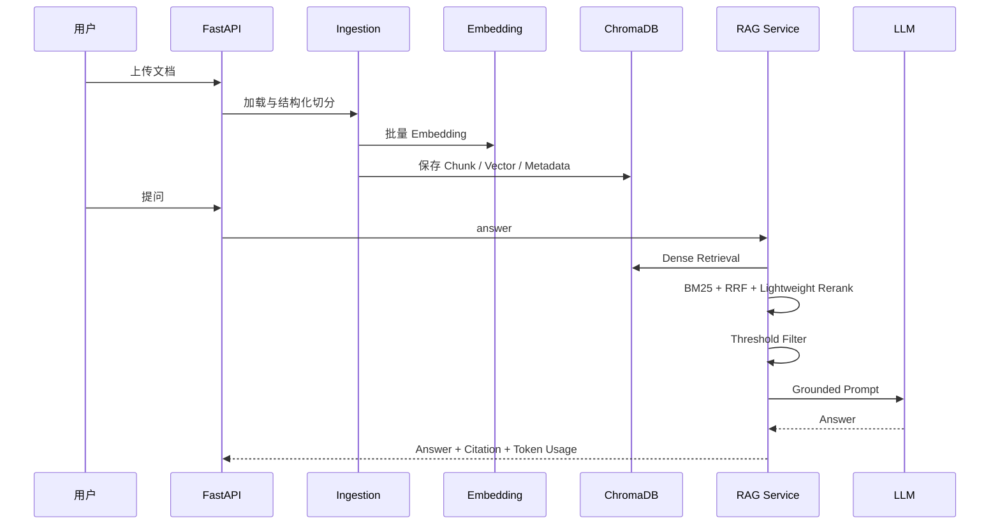
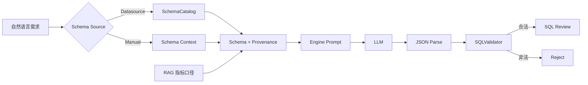
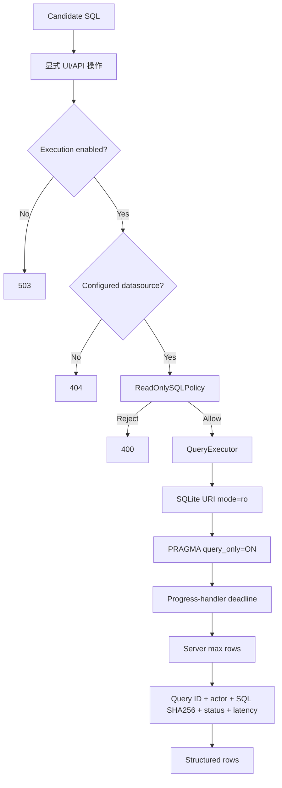
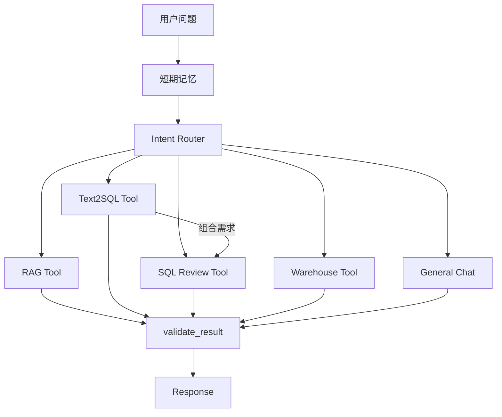
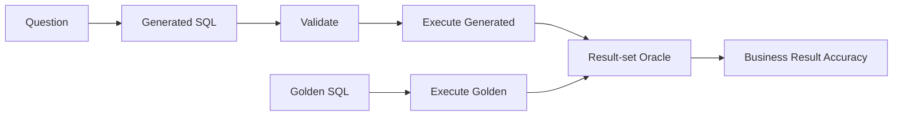
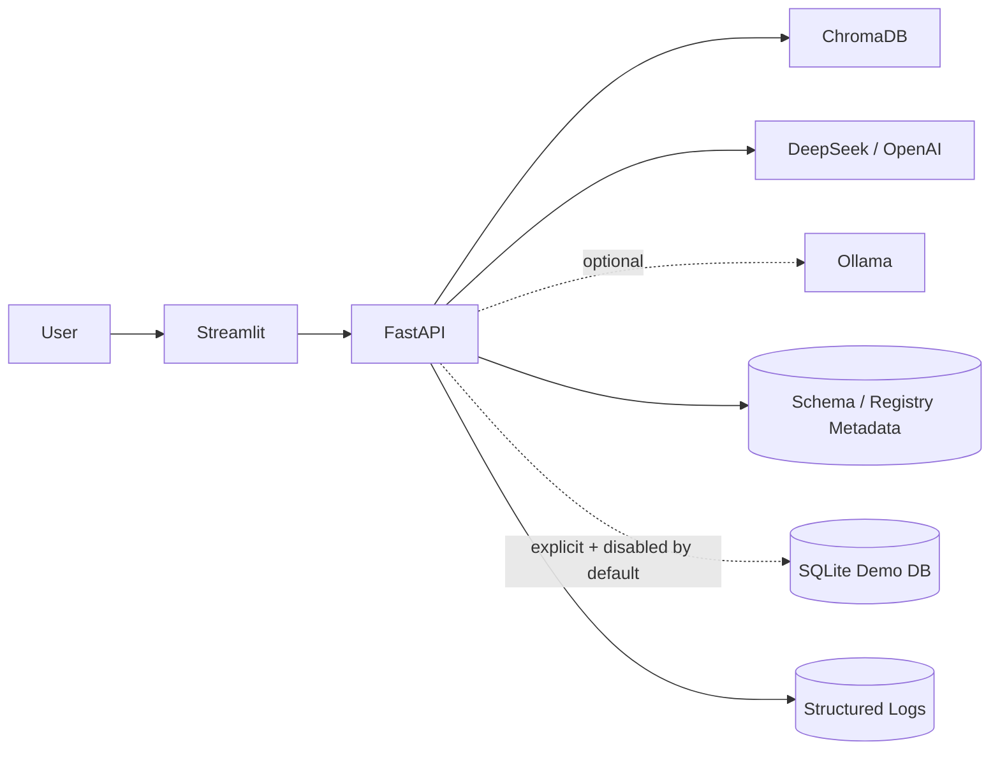

# 系统架构

DataPilot-AI 是面向数据分析与数据工程场景的 AI 应用。核心原则是：**LLM 负责生成候选结果，确定性代码负责约束和治理，有副作用的能力保持显式边界，质量指标必须能回到可复现数据。**

## 分层结构



### 领域端口

应用层依赖四个主要端口：

- `LLMProvider`：隔离 DeepSeek / OpenAI / Ollama；
- `VectorStore`：隔离 ChromaDB；
- `QueryExecutor`：隔离 SQLite 及未来 MySQL/ClickHouse 只读执行器；
- `SchemaCatalog`：隔离数据库/数据平台元数据发现。

`QueryExecutor` 和 `SchemaCatalog` 是不同能力。一个数据源可以允许读取 Schema，但仍禁止执行模型生成 SQL。

### 表现层

- FastAPI 暴露健康检查、身份、知识库、Agent、Text2SQL、SQL Review、Schema discovery、只读执行和数仓设计；
- Pydantic v2 提供请求/响应与统一错误模型；
- Streamlit 只通过 HTTP 调用后端，不直接持有模型密钥或数据库连接；
- Text2SQL UI 可选择已配置 datasource，由后端自动发现 Schema；
- 只有 SQL 校验通过、执行显式启用且数据源可用时，UI 才提供执行入口。

### 应用层

- **RAG**：摄取、切分、检索、融合、重排、引用、拒答；
- **Text2SQL**：Schema source resolution、Prompt、结构化解析、SQLValidator、优化建议；
- **SQL Review**：确定性规则、风险评分、可选 LLM 解释；
- **Query Execution**：ReadOnlySQLPolicy、数据源选择、行数/超时边界、审计；
- **Agent**：意图识别、工具编排、短期记忆、结果校验；
- **Evaluation**：Agent 指标、Text2SQL benchmark、Golden Result Oracle、安全策略 benchmark。

## 总体请求链路



重要边界：**Agent 不自主调用 Query Execution。** 数据库读取即使无写副作用，也有成本、权限和数据暴露风险，因此保留为用户显式操作。

## Datasource Schema Discovery

手工把 DDL 复制进 Prompt 只适合原型。真实产品需要对 Schema provenance 建模。



当前 SQLite Adapter 从 `sqlite_schema` 读取用户表，按表名稳定排序并构造 Snapshot。Fingerprint 用来描述“这次生成基于哪一版 Schema”，不承担授权功能。

Datasource 模式约束：

- `datasource` 与 `schema_context` 互斥；
- 引擎由 datasource 决定；
- 显式传入不匹配引擎会被拒绝；
- Schema discovery 不受 SQL execution feature flag 控制；
- 凭据、文件路径等敏感配置不进入 Schema API 响应。

## LLM Provider 边界

运行时只选择一个主 Provider，模型选择属于组合根职责：



本分支删除任务级 local/cloud Routing Provider。只有当真实 benchmark 证明成本、隐私或质量收益时，才值得重新增加模型路由。

## RAG 流程



低于阈值或无候选时拒答，避免模型脱离检索证据补全企业事实。文档 Registry 使用 SQLite 持久化，避免服务重启后文档目录状态消失。

## Text2SQL 安全链路



`SQLValidator` 负责生成质量和静态安全：单条 `SELECT/WITH`、DML/DDL/权限/管理语句拒绝、未知表/字段、JOIN、笛卡尔积、`SELECT *` 和引擎规则。

它不是数据库权限系统。

## 受治理只读执行边界

执行层是独立应用服务，不是 Text2SQL 内部的 `execute=True` 开关。



防御纵深：

1. 默认关闭 execution；
2. 只接受服务端配置 datasource；
3. 独立 `ReadOnlySQLPolicy`；
4. 数据库只读模式；
5. deadline；
6. server row cap；
7. 结构化审计；
8. API key / role gate。

生产 MySQL/ClickHouse 还必须叠加原生只读账号、statement timeout、资源组/扫描量、并发限制和 Secret Manager。

## 身份与 RBAC

所有 `/api/v1/*` 路由位于受保护 Router 下；`/health` 保持公开健康检查。鉴权关闭时允许本地开发；开启后通过 `X-API-Key` 解析 principal。

角色最小权限：

- reader：读取 API 与 Schema 元数据；
- analyst：在 reader 基础上可显式执行只读查询；
- admin：管理级能力。

当前是轻量 API-key RBAC，不代表已经实现企业 IAM。多租户部署仍需 OIDC/SSO、tenant/workspace identity 和 tenant-scoped data policy。

## Agent 流程



工具参数由 Pydantic/JSON Schema 约束，图有最大步骤/递归边界。数据库执行不进入 Agent Tool 列表。

## Evaluation / Golden Result Oracle

项目拒绝用一个笼统“准确率”覆盖整个 AI 系统。

Text2SQL benchmark 分开记录：

- generation success；
- SQL validation pass；
- execution attempted / succeeded；
- expected table recall；
- schema hallucination；
- result oracle coverage；
- result comparison rate；
- **business result accuracy**；
- generation P95 latency；
- execution latency；
- token usage。

Safety benchmark 记录 decision accuracy、unsafe rejection rate 和 safe acceptance rate。

每个零售 case 包含 `golden_sql`。Runner 在同一只读数据源执行生成 SQL 和 Golden SQL，再比较结果集。



`business_result_accuracy` 的分母是全部存在 Oracle 的 case，所以生成失败、校验失败和执行失败会真实拉低端到端结果，而不是从指标里被过滤掉。

当前通用 helper 只适合零售小型聚合结果：忽略行顺序和列别名，并对数值做有限精度归一化。生产复杂 SQL 应采用 case-specific oracle，尤其要显式处理 duplicate、ordering、NULL、timestamp 和近似聚合语义。

## 可复现零售场景

`examples/retail_analytics/` 包含：Schema、seed data、指标口径、问题集、Golden SQL、安全测试集、SQLite 初始化脚本、演示脚本和 benchmark runner。

```bash
python examples/retail_analytics/setup_demo_db.py --force
python manage.py start --no-open
python examples/retail_analytics/evaluate_text2sql.py
```

Benchmark 使用 datasource-driven Text2SQL，因此会覆盖真实 Schema discovery，而不是维护一套与产品主链路不同的评测入口。

## 部署拓扑



Docker Compose 提供健康检查、资源限制、网络和项目内数据挂载。

## 下一阶段生产化重点

- 多数据源 Registry + MySQL/ClickHouse Schema/Query adapters；
- OIDC/SSO、Workspace/Tenant 隔离和 tenant-scoped RBAC；
- OpenTelemetry + LLM/Query spans + metrics dashboard；
- 异步文档摄取任务队列；
- Redis/DB 分布式会话状态；
- 版本化 benchmark、case-specific oracle 和模型质量回归阈值。
