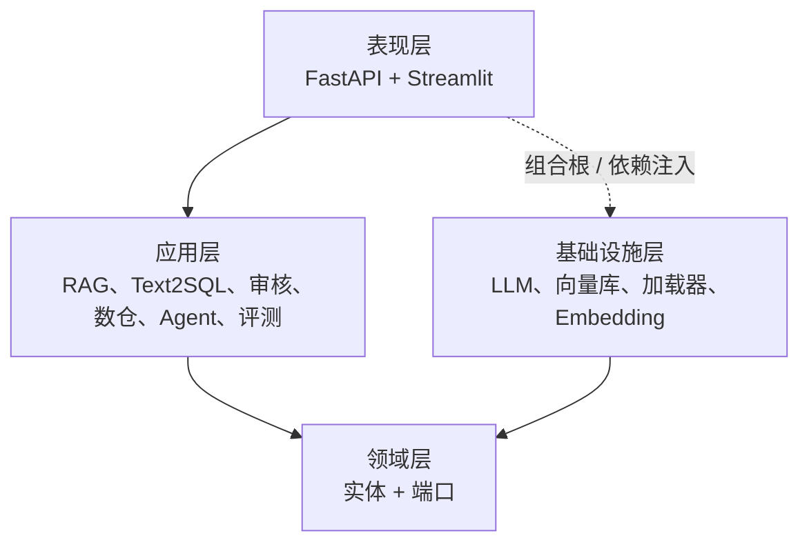
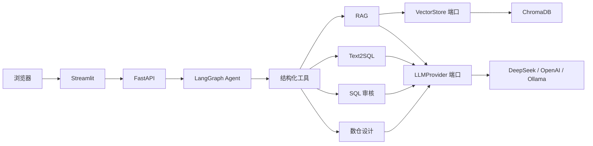
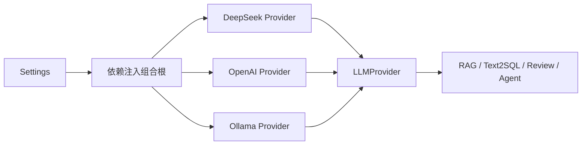
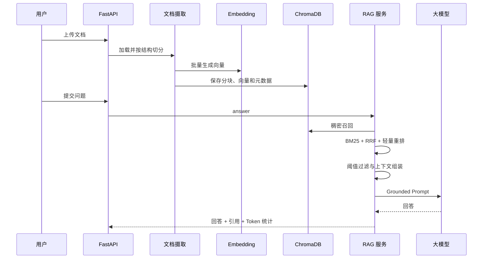
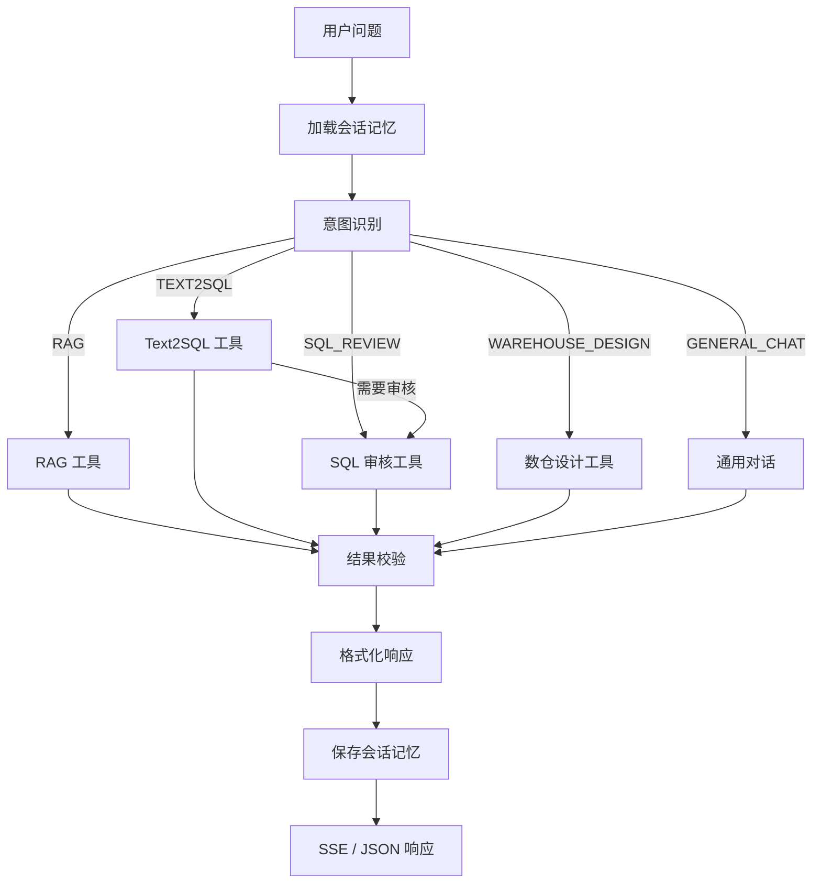
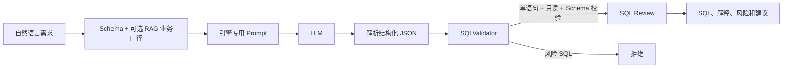
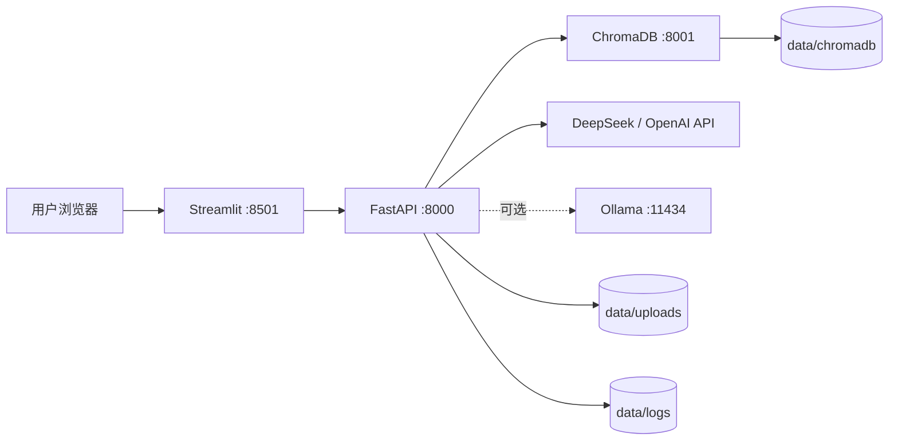

# 系统架构

DataPilot-AI 是面向数据分析与数据工程场景的 AI 应用，采用类似 Clean Architecture 的分层方式。应用层只依赖领域端口，DeepSeek、OpenAI、Ollama、ChromaDB 等基础设施实现可以替换，而不会把厂商 SDK 细节扩散到业务服务。

## 分层结构

### 表现层

- FastAPI 暴露健康检查、知识库、对话、Agent、Text2SQL、SQL 审核和数仓设计接口。
- Pydantic v2 负责请求、响应和统一错误格式校验。
- Streamlit 仅通过 HTTP 调用后端，不直接访问大模型、向量库和文件系统。

### 应用层

- RAG：文档摄取、切分、检索、融合、重排、引用和有依据回答。
- Text2SQL：构建 Prompt、解析结构化输出、校验 SQL 并返回优化建议。
- SQL 审核：确定性规则、风险评分和可选大模型解释。
- 数仓设计：生成分层模型、表结构、指标、数据流和 DDL。
- Agent：意图识别、工具调用、多步骤工作流、会话记忆和响应组装。
- 评测：意图准确率、Precision@K、MRR 和工具成功率等离线指标。

### 领域层

- 定义文档、分块、引用和搜索结果等实体。
- 定义 `LLMProvider` 与 `VectorStore` 端口，使业务逻辑不依赖具体厂商。

### 基础设施层

- DeepSeek Provider：异步对话、流式调用、超时、有限重试、健康检查和 Token 统计。
- OpenAI Provider：标准 OpenAI Chat Completions 兼容实现。
- Ollama Provider：本地模型对话、流式输出和模型可用性检查。
- ChromaDB：向量持久化、相似度检索和元数据过滤。
- 文档加载器：TXT、Markdown、PDF 和 DOCX。
- BGE-M3：文本和查询 Embedding。

## 总体架构

## LLM Provider 边界

运行时只选择一个主 Provider。模型选择属于应用组合根职责，RAG、Text2SQL、SQL Review 等业务服务只看到统一 `LLMProvider` 端口。

这种设计刻意避免按业务任务再叠加一层模型路由：如果以后确实存在成本、隐私或质量数据证明需要多模型路由，可以在组合根重新引入，但不让路由逻辑侵入领域服务。

## RAG 流程

默认使用混合检索，也可以使用纯向量检索。无候选或候选低于阈值时应拒答，而不是让模型补全未知事实。

## Agent 流程

专业节点通过结构化工具调用。每个工具具有 Pydantic 输入模型和 JSON Schema。工作记忆保存在 `AgentState`，短期记忆按 `session_id` 保存，超出窗口的旧消息被压缩为摘要，`recursion_limit` 限制图的最大执行步数。

`validate_result` 节点在领域节点执行后、格式化前运行：对 Text2SQL 复用 SQL 校验，对 SQL 审核重跑规则核对结论一致性，对数仓设计检查分层与 DDL，对 RAG 检查引用与回答。校验结果会作为结构化元数据返回，不让“Agent 已完成”替代结果验证。

## Text2SQL 与 SQL 审核

SQL 安全校验是确定性步骤，不依赖模型自我声明“安全”。当前校验至少包括：

- 只接受单条 `SELECT` / `WITH` 查询；
- 拒绝常见 DDL/DML/权限语句；
- 检查未知表、未知字段；
- 检查缺失 JOIN 条件、笛卡尔积风险；
- 对 `SELECT *`、分区过滤等给出规则提示。

## 数据库执行边界

项目当前默认负责**生成、校验和审核 SQL**，不直接连接任意生产数据库执行模型生成语句。这是安全设计，而不是功能缺失的掩饰。

如果后续增加生产只读执行器，至少应同时具备：

1. 独立只读数据库账号和最小权限；
2. statement/query timeout；
3. 最大返回行数与结果大小限制；
4. 数据源和 Schema 白名单；
5. SQL 审计日志与 request/trace ID；
6. 高风险查询拒绝或人工确认；
7. 必要时增加数据库原生资源组、扫描量和并发限制。

应用层 SQLValidator 只能做第一道防线，不能替代数据库权限和资源治理。

## 可复现业务场景

`examples/retail_analytics/` 提供零售经营分析示例，包括：

- 订单、客户、商品、退款 Schema；
- GMV、退款率、客单价等业务口径；
- 可重复执行的 Text2SQL 问题集；
- 调用后端 API 的演示脚本。

该目录用于验证“业务知识 RAG + Text2SQL + 安全校验”的应用闭环，而不是只展示单个模型调用。

## 部署拓扑

Docker Compose 为服务配置健康检查、资源限制、统一网络和项目内持久化目录。生产环境还需要反向代理、TLS、认证、限流、集中日志、指标告警和备份。
