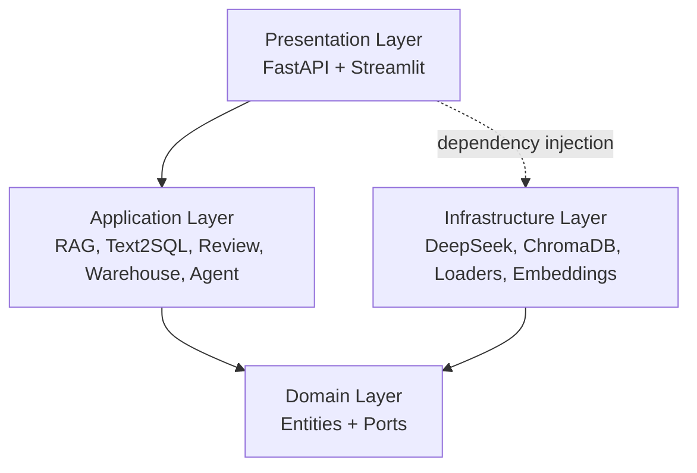
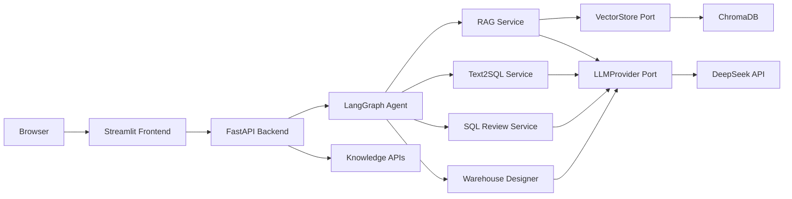
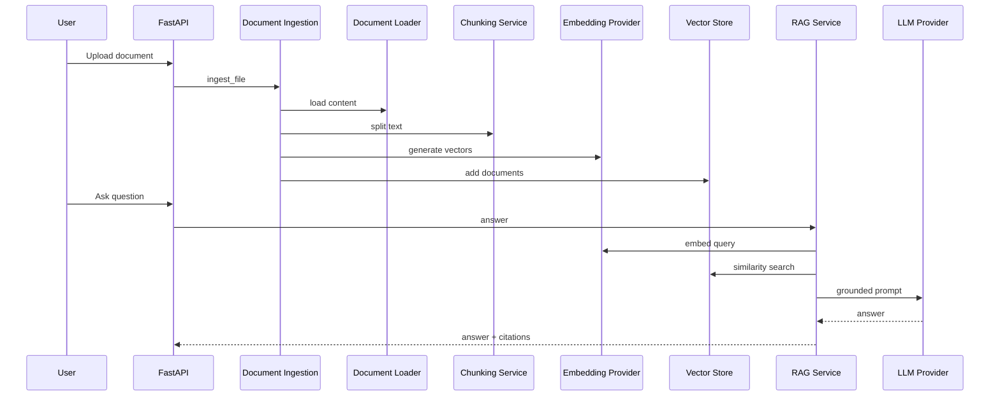
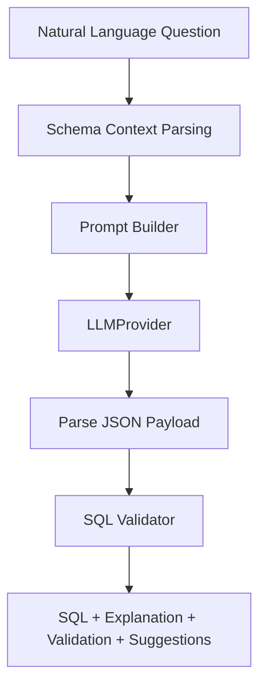
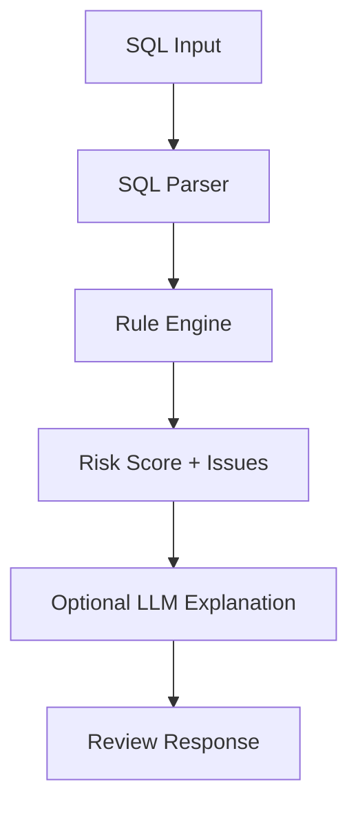
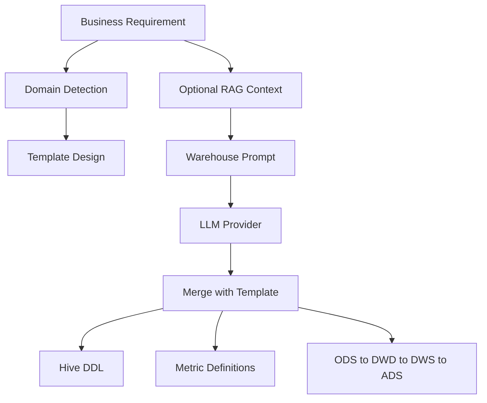
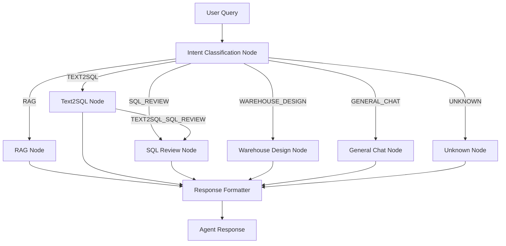
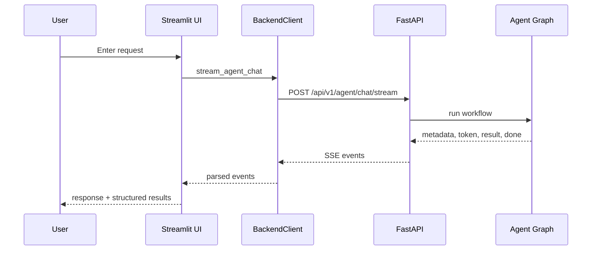
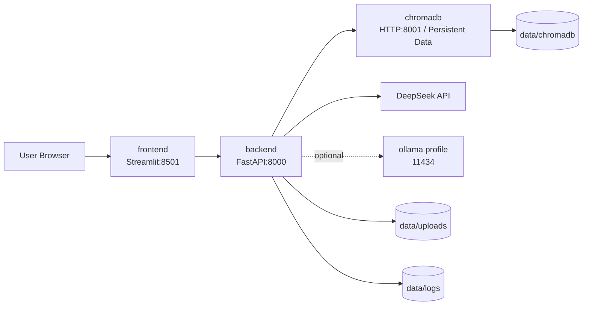

# Architecture

DataPilot-AI is an AI Agent Platform for Data Engineering built with Clean Architecture. Business logic depends on interfaces, while infrastructure implementations such as DeepSeek and ChromaDB remain swappable.

## Clean Architecture

## Layers

### Presentation Layer

- FastAPI routes expose health, knowledge, chat, agent, Text2SQL, SQL review, warehouse design, and runtime config APIs.
- Pydantic v2 schemas validate all request and response contracts.
- Streamlit pages call only FastAPI APIs through `frontend/services/backend_client.py`.

### Application Layer

- RAG services coordinate ingestion, chunking, retrieval, citation generation, and grounded answering.
- Text2SQL builds prompts, parses LLM JSON, validates generated SQL, and returns optimization hints.
- SQL Review combines deterministic rules with optional LLM explanations.
- Warehouse Design generates layered data warehouse outputs, Hive DDL, metrics, relationships, and recommendations.
- Agent uses LangGraph to classify intent, route workflows, execute specialist nodes, and format responses.

### Domain Layer

- Entities define documents, chunks, metadata, and vector search contracts.
- Ports define `LLMProvider` and `VectorStore`, keeping business logic independent from DeepSeek and ChromaDB.

### Infrastructure Layer

- DeepSeek provider implements async chat, streaming, retry, timeout, health check, and usage tracking.
- ChromaDB adapter implements vector store operations and persists under project-local data paths.
- Document loaders support TXT, Markdown, PDF, and DOCX.
- Embedding provider abstraction enables future OpenAI, Ollama, and local embedding backends.

## System Architecture

## RAG Pipeline

## Text2SQL Flow

## SQL Review Flow

## Warehouse Design Flow

## LangGraph Agent Flow

## Frontend/Backend Interaction

## Deployment Topology

