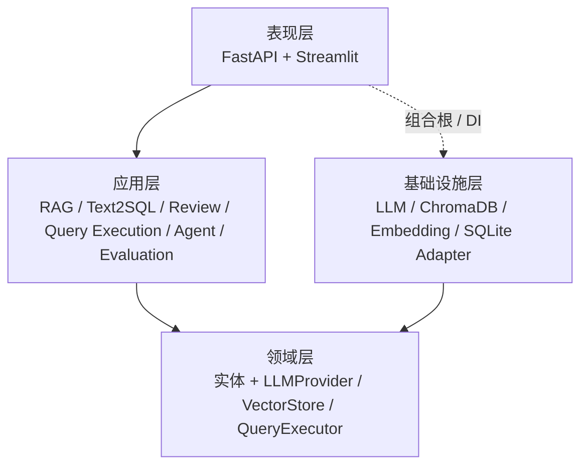
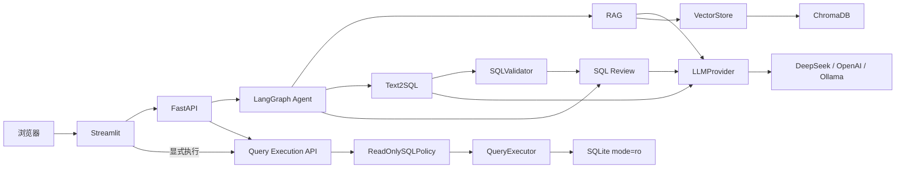
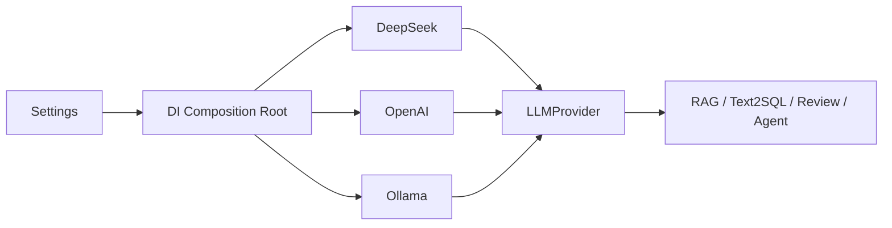
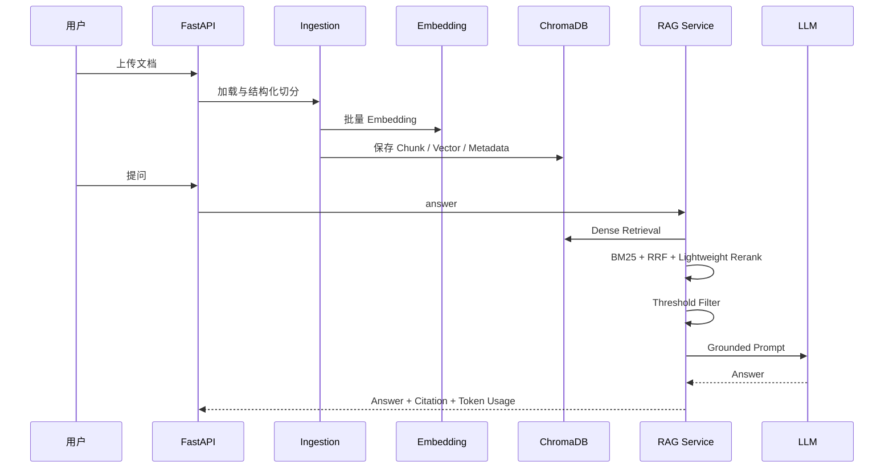
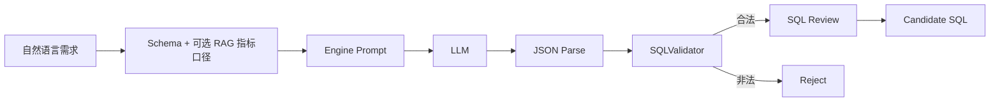
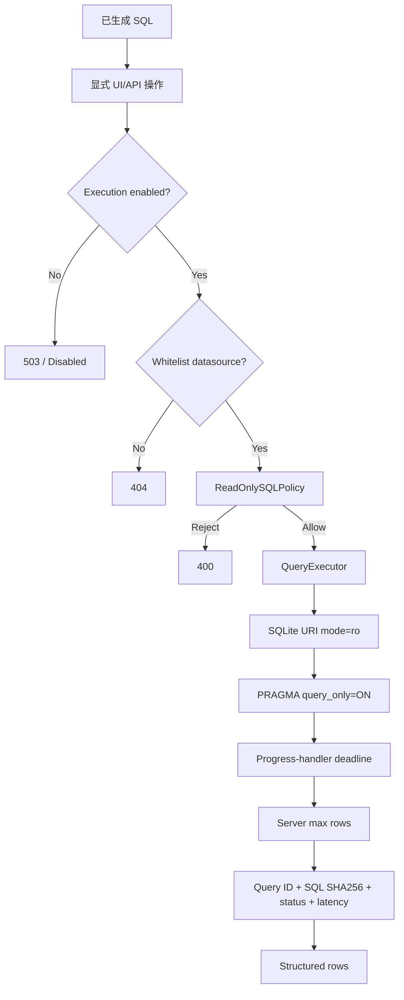
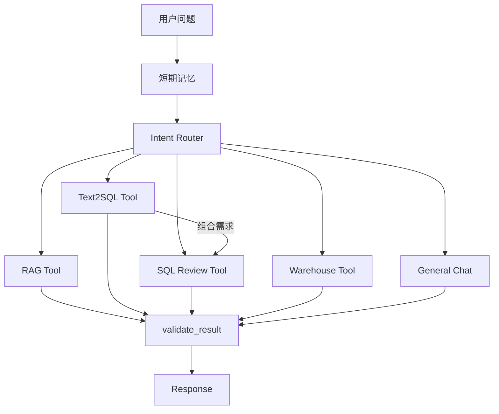
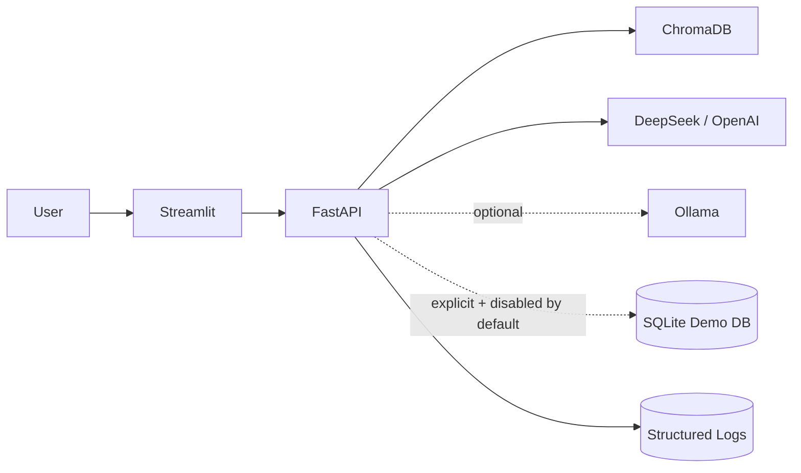

# 系统架构

DataPilot-AI 是面向数据分析与数据工程场景的 AI 应用，采用端口/适配器风格的分层架构。核心原则是：**LLM 负责生成候选结果，确定性代码负责约束和治理，有副作用的能力保持显式边界。**

## 分层结构



### 表现层

- FastAPI 暴露健康检查、知识库、Agent、Text2SQL、SQL Review、只读查询执行和数仓设计接口；
- Pydantic v2 提供请求/响应 Schema 和统一错误模型；
- Streamlit 只通过 HTTP 调用后端，不直接持有数据库连接或模型密钥；
- Text2SQL UI 只有在 SQL 校验通过、后端执行显式启用且白名单数据源可用时才展示执行入口。

### 应用层

- **RAG**：摄取、切分、检索、融合、重排、引用、拒答；
- **Text2SQL**：Prompt、结构化解析、SQLValidator、优化建议；
- **SQL Review**：确定性规则、风险评分、可选 LLM 解释；
- **Query Execution**：ReadOnlySQLPolicy、数据源选择、行数/超时边界、审计；
- **Agent**：意图识别、工具编排、短期记忆、结果校验；
- **Evaluation**：Agent 指标、Text2SQL benchmark、安全策略 benchmark。

### 领域层

应用层依赖三个核心端口：

- `LLMProvider`：隔离 DeepSeek/OpenAI/Ollama；
- `VectorStore`：隔离 ChromaDB；
- `QueryExecutor`：隔离 SQLite 以及未来 MySQL/ClickHouse 只读执行器。

执行服务不依赖 SQLite，SQLite 只是当前基础设施适配器。

### 基础设施层

- DeepSeek / OpenAI / Ollama Provider；
- ChromaDB VectorStore；
- BGE-M3 Embedding；
- TXT / Markdown / PDF / DOCX Loader；
- `SQLiteReadOnlyExecutor`：可复现本地只读数据源。

## 总体请求链路



一个重要边界：**Agent 当前不会自主调用 Query Execution。** 数据库执行属于有副作用/资源消耗的操作，即使是只读，也保留为显式 API/UI 动作。

## LLM Provider 边界

运行时只选择一个主 Provider，模型选择属于组合根职责。



本分支删除任务级 local/cloud Routing Provider，避免把模型策略扩散到业务服务。未来只有在真实成本/隐私/质量数据证明必要时，才应重新增加模型路由。

## RAG 流程



低于阈值或无候选时应拒答，避免模型脱离检索证据补全企业事实。

## Text2SQL 安全链路



`SQLValidator` 是生成阶段的确定性防线：

- 单条 `SELECT/WITH`；
- DML/DDL/权限/管理语句拒绝；
- 未知表/字段检查；
- JOIN 条件、笛卡尔积、`SELECT *`、引擎规则检查。

它不被当成数据库权限系统。

## 受治理只读执行边界

执行层是独立应用服务，而不是 Text2SQL 内部的一个 `execute=True` 开关。



当前安全措施：

1. **默认关闭**：`DATACOPILOT_QUERY_EXECUTION__ENABLED=false`；
2. **白名单数据源**：API 不接受任意 DB URL/path；
3. **二次只读策略**：即使 SQL 已通过 Text2SQL Validator，执行前仍重验；
4. **数据库只读模式**：SQLite `mode=ro` + `query_only`；
5. **Deadline**：progress handler 中断超时查询；
6. **服务端 Row Cap**：客户端不能放大配置上限；
7. **审计**：记录 Query ID、数据源、SQL SHA-256、状态、耗时和结果规模，不记录数据库凭据。

生产 MySQL/ClickHouse 适配器还必须叠加数据库原生只读账号、statement timeout、资源组/扫描量、并发限制和 Secret Manager。

## Agent 流程



工具参数由 Pydantic/JSON Schema 约束；图有最大步骤/递归边界。执行数据库没有放入 Agent Tool 列表，避免自主链路引入隐式资源副作用。

## Evaluation / Benchmark

项目不使用一个笼统“准确率”覆盖所有问题。

Text2SQL benchmark 分开记录：

- generation success；
- SQL validation pass；
- execution attempted / succeeded；
- expected table recall；
- schema hallucination；
- generation P95 latency；
- execution latency；
- token usage。

Safety benchmark 记录：

- decision accuracy；
- unsafe rejection rate；
- safe acceptance rate。

`Execution Success` 只表示 SQL 在受控数据源上成功运行，**不是业务结果正确率**。真正的结果准确率需要 golden SQL / golden result oracle。

## 可复现零售场景

`examples/retail_analytics/` 包含 Schema、seed data、指标口径、问题集、安全测试集、SQLite 初始化脚本、演示脚本和 benchmark runner。

本地流程：

```bash
python examples/retail_analytics/setup_demo_db.py --force
# 显式开启 .env 中 QUERY_EXECUTION
python manage.py start --no-open
python examples/retail_analytics/run_demo.py
python examples/retail_analytics/evaluate_text2sql.py
```

## 部署拓扑



Docker Compose 提供健康检查、资源限制、网络和项目内数据挂载。当前成熟化的下一阶段是：API 鉴权/RBAC、持久化 Registry、MySQL/ClickHouse 只读适配器、OpenTelemetry/LLM tracing、异步摄取任务队列。