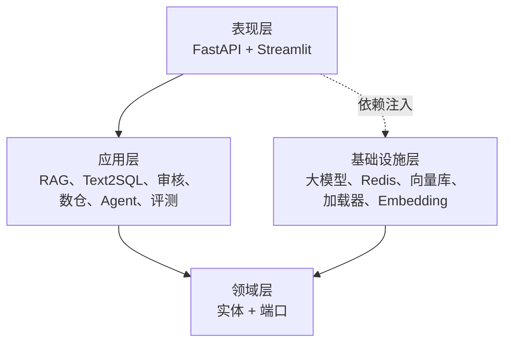
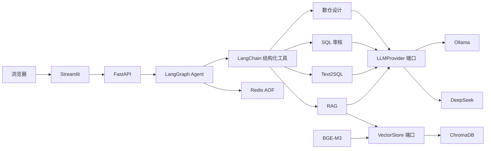
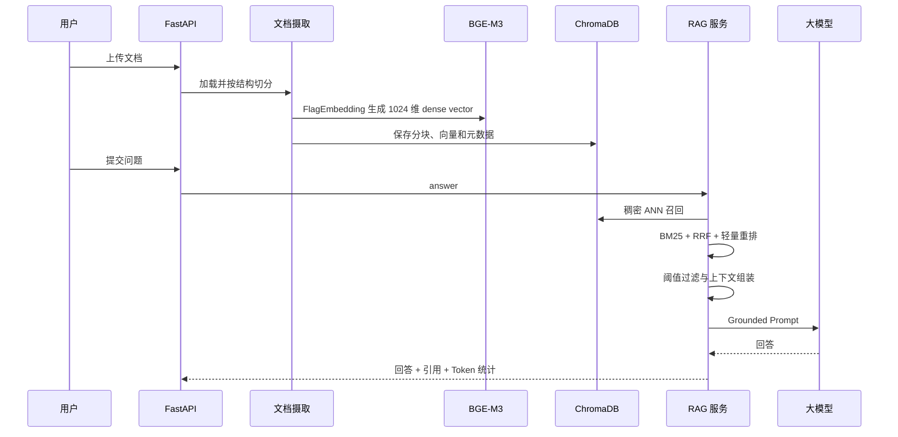
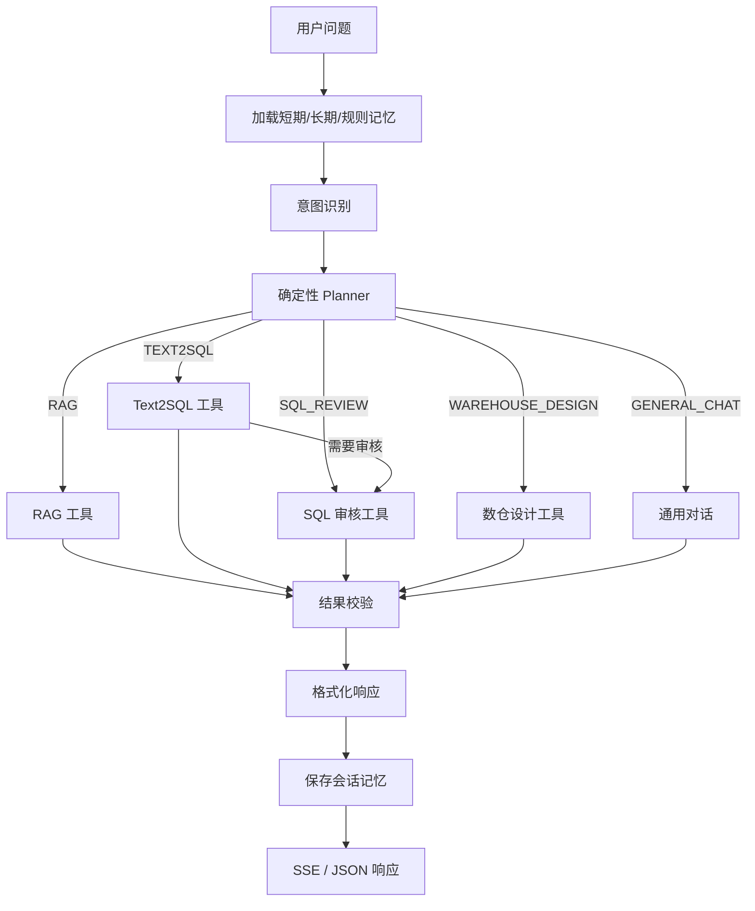
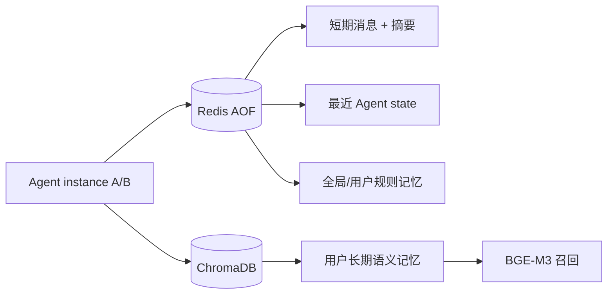
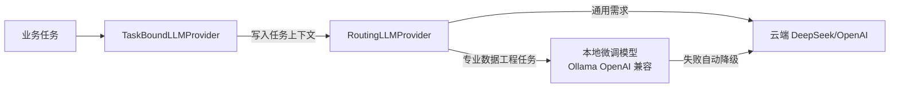
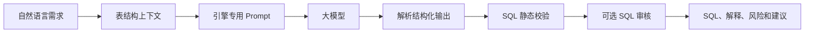
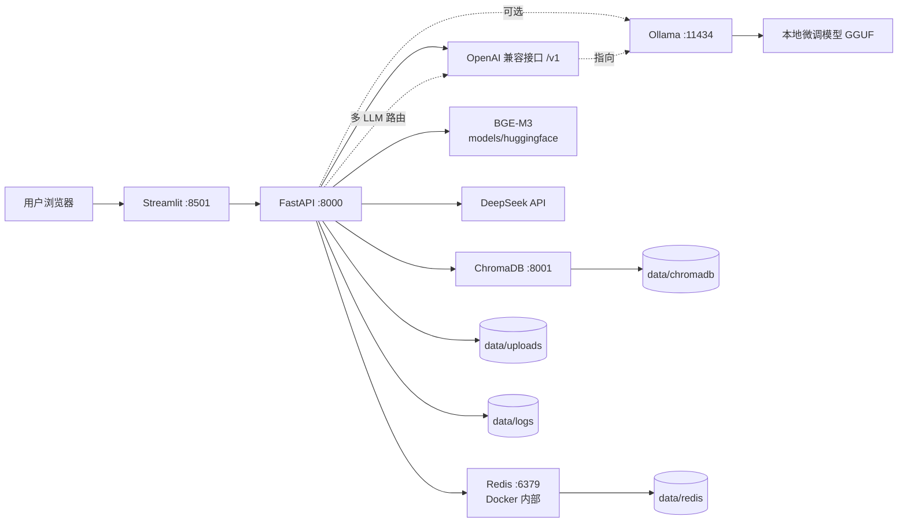

# 系统架构

DataPilot-AI 是面向数据工程的 AI 智能体平台，采用整洁架构。应用层只依赖领域端口，DeepSeek、Ollama、ChromaDB 等实现可以独立替换。

## 分层结构

### 表现层

- FastAPI 暴露健康检查、知识库、对话、Agent、Text2SQL、SQL 审核和数仓设计接口。
- Pydantic v2 负责请求、响应和错误格式校验。
- Streamlit 仅通过 HTTP 调用后端，不直接访问大模型、向量库和文件系统。

### 应用层

- RAG：文档摄取、切分、检索、融合、重排、引用和有依据回答。
- Text2SQL：构建 Prompt、解析结构化输出、校验 SQL 并返回优化建议。
- SQL 审核：确定性规则、风险评分和可选大模型解释。
- 数仓设计：生成分层模型、表结构、指标、数据流和 DDL。
- Agent：意图识别、Planner、工具调用、多步骤工作流、三层记忆和响应组装。
- 评测：意图准确率、Precision@K、MRR 和工具成功率。

### 领域层

- 定义文档、分块、引用和搜索结果等实体。
- 定义 `LLMProvider` 与 `VectorStore` 端口，使业务逻辑不依赖具体厂商。

### 基础设施层

- DeepSeek Provider：异步对话、流式调用、超时、重试、健康检查和 Token 统计。
- OpenAI Provider：通用 OpenAI 兼容 Chat Completions 客户端，同时服务 OpenAI 云端与 Ollama 本地 OpenAI 兼容接口（无鉴权时自动省略 Authorization 头）。
- Ollama Provider：本地模型对话、流式输出、模型可用性检查（原生 `/api/chat`）。
- Routing Provider：多 LLM 智能路由，按业务任务在本地微调模型与云端模型间分发。
- ChromaDB：向量持久化、相似度检索和元数据过滤。
- Redis：AOF 持久化短期消息、最近 Agent state 和规则记忆，供多 backend 实例共享。
- 文档加载器：TXT、Markdown、PDF 和 DOCX。
- BGE-M3：通过 FlagEmbedding lazy-load `BAAI/bge-m3`，当前使用真实 1024 维 dense 向量；模型缓存挂载到 `models/huggingface`。

## 总体架构

## RAG 流程

默认使用混合检索，也可以通过 `retrieval_mode=vector` 使用纯向量检索。无候选或候选低于阈值时直接拒答，不调用大模型补全未知事实。

## Agent 流程

Planner 根据意图生成确定性的步骤清单并写入 `AgentState`/响应 metadata，不额外消耗 LLM Token。专业节点通过 LangChain `StructuredTool` 调用。每个工具具有 Pydantic 输入模型和 JSON Schema。工作记忆保存在 `AgentState`；Docker 模式下短期记忆按 `user_id + session_id` 保存到 Redis，超出窗口的旧消息被压缩为摘要。`recursion_limit` 限制图的最大执行步数。

JSON 接口的 Agent 异常进入统一错误响应；SSE 在响应已开始后发生故障时返回 `error` 和 `done(status=failed)` 事件，避免连接以未处理异常中断。

## Agent 三层记忆

- 短期记忆按 `user_id + session_id` 保存，带 TTL、摘要压缩和并发事务更新。
- 会话状态保存最近一次 intent、plan、routing path、result、错误和 token usage，可被其他实例读取。
- 长期记忆只通过显式 API 写入，按 `user_id` 隔离并使用 BGE-M3 语义召回。
- 规则记忆分 global/user scope，按 priority 合并后注入 Agent context。
- 当前 `user_id` 是应用层标识；正式公网部署必须由认证网关注入，不能信任客户端自报身份。

`validate_result` 节点在领域节点执行后、格式化前运行：对 Text2SQL 复用 `SQLValidator` 做结构/引擎校验，对 SQL 审核重跑规则引擎核对结论一致性（发现幻觉结论），对数仓设计校验分层覆盖率与 DDL，对 RAG 校验引用与回答。校验结果经 `result["validation"]`（或 `metadata["validation"]` 摘要）透出，不阻断主流程。

## 多 LLM 智能路由

- 领域服务通过组合根注入 `TaskBoundLLMProvider`，在调用时把 `TaskType`（rag/text2sql/sql_review/warehouse_design/general_chat）写入 `ContextVar`。
- `RoutingLLMProvider` 读取上下文，将 Text2SQL、SQL 审核、数仓设计等专业数据工程任务路由到本地微调模型，通用对话与 RAG 路由到云端。
- 本地模型未导入或 Ollama 未启动时自动降级到云端，专业任务不中断。
- 关闭 `DATACOPILOT_LLM__ROUTING_ENABLED` 即回退为单一 provider 行为，与旧版本完全一致。

## Text2SQL 与 SQL 审核

SQL 校验和规则审核是确定性步骤，不依赖大模型判断核心安全规则。项目当前只生成和审核 SQL，不直接执行生产数据库写操作。

生成结果只允许单条 `SELECT`/`WITH ... SELECT`：DDL、DML、注释、`SELECT INTO` 和多语句会被拒绝，合法查询会自动追加或收紧为最多 `LIMIT 500`。项目没有数据库执行器，因此“执行超时、只读账户、事务回滚”属于未来接入执行层时必须实现的边界，而不是当前已存在能力。

## 部署拓扑

Docker Compose 为服务配置健康检查、资源限制、统一网络和项目内持久化目录。生产环境还需要反向代理、TLS、认证、限流、集中日志和备份。

本地开发使用嵌入式 `PersistentClient`；Docker 中 backend 使用 `HttpClient` 通过 `chromadb:8000` 访问独立 Chroma 服务，只有 Chroma 容器挂载 `data/chromadb`，避免两个进程并发打开同一存储。
