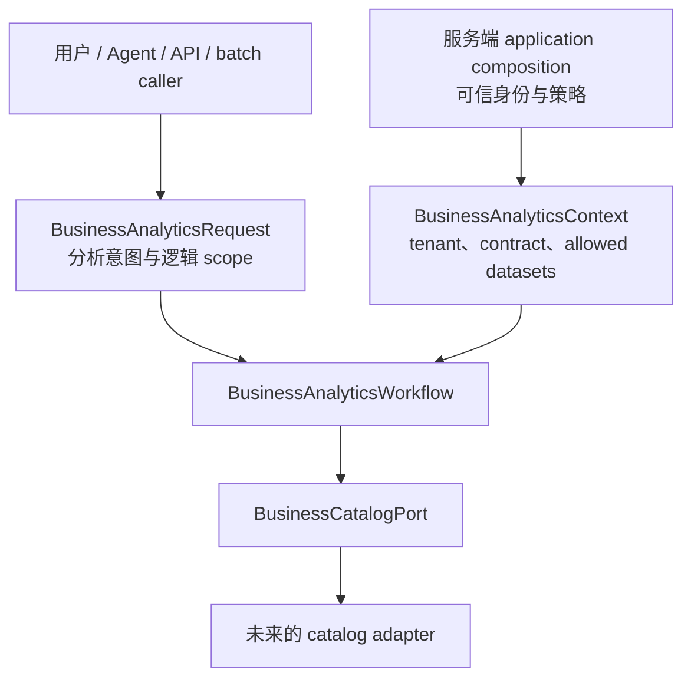

# Managed Business Analytics 边界（D1）

## 目的与当前状态

DataCopilot 已有通用 Text2SQL 和 Agent 工作流。这些路径允许用户手工提供 schema context，适用于演示、开发和独立 SQL 生成；它们没有建立企业身份、tenant 授权或可信业务目录。

D1 新增内部 application boundary，用于解析可信 catalog snapshot 并准备授权后的逻辑 dataset scope。D2 在 infrastructure 层增加了对仓库内 pinned Business Data Contract v1 JSON 的 consumer adapter。本阶段仍不消费 delivery、不生成或校验 SQL、不连接数据仓库、不执行查询，也不公开 HTTP endpoint。当前项目没有可信 tenant identity 来源，所以没有 production Agent adapter。

## Agent 与 Workflow 的职责

Agent 可以表达分析问题、请求逻辑 dataset scope，并提出 SQL engine 偏好。Agent 不能选择 tenant、contract version、catalog 来源、数据库凭证或执行策略。

`BusinessAnalyticsWorkflow` 是 application service。它接收独立的 `BusinessAnalyticsRequest` 和 `BusinessAnalyticsContext`，通过 `BusinessCatalogPort` 解析 catalog，核对 tenant 与 contract identity，并在 catalog 或请求 scope 超出可信上下文时 fail closed。它不依赖 LangGraph state，也不导入 Agent runtime。未来的 API、batch job 或评测 runner 都可以直接调用它。

调用方提供 request；服务端 application composition 在应用可信身份和策略后，沿另一条路径提供 context。Pydantic 类型或 `frozen=True` 本身不能证明数据来源；不得从 Agent JSON arguments 构造 trusted context。

## Request 与 trusted context

`BusinessAnalyticsRequest` 是不可信意图 contract，字段为：

- `question`：自然语言分析意图。
- `engine`：请求使用的 SQL engine 偏好，默认 Hive。
- `requested_datasets`：可选的逻辑 dataset 名称，例如 `orders_v1`。这是请求范围，不是授权结果。

模型拒绝额外字段。它不接收 `tenant_id`、`user_id`、原始 `schema_context`、数据库 URL 或凭证、delivery path、contract identity、任意 allowed-table 列表、SQL、行数限制或 timeout/execution 策略。Dataset 名称必须是逻辑标识，不能是 database-qualified name 或文件路径。

`BusinessAnalyticsContext` 是由服务端 application composition 单独注入的不可变可信上下文，仅包含 `request_id`、`tenant_id`、预期的 `contract_name` 和 `contract_version`，以及权威的 `allowed_datasets` 范围。它不包含 `user_id`：用户身份、tenant 身份和业务数据范围是不同概念。当前 Agent 的 `user_id` 是应用层 memory 标识；项目文档说明生产身份应来自认证系统。DataCopilot 当前没有这样的可信认证边界，因此 D1 不从 `user_id` 推导 tenant，也不将 workflow 注册为 Agent tool。

## Catalog port 与 typed snapshot

`BusinessCatalogPort.resolve(context)` 是 producer-agnostic application port。Infrastructure 中的 `BusinessDataContractCatalog` 实现该 port，只接收单独注入的 trusted context，返回 `BusinessCatalogSnapshot`，不会返回任意 schema 字符串。Application 不读取文件，也不导入 infrastructure。

Snapshot 带有 tenant 和 contract identity、catalog fingerprint、typed classification definitions 与 datasets。每个 dataset 描述逻辑名称、说明、粒度、复合 primary key、sensitivity/stability、字段和关系。每个字段保留名称、description、逻辑类型、nullable、业务含义、enum/decimal/timestamp/identifier 语义、typed references 和 classification（`public`、`internal`、`confidential`、`restricted`）。D2 不根据 classification 推导允许/拒绝规则；后续受控策略必须明确决定其用途。

Workflow 会核对 catalog tenant 与 contract 是否精确匹配 context、catalog 返回的 dataset 是否都在可信 scope 内，以及每个请求的 dataset 是否同时属于可信 scope 和 catalog。失败时抛出固定安全消息的 typed boundary error，不回传 adapter 异常文本或原始 delivery 内容。结果只含 request/contract identity、catalog fingerprint、已准备的逻辑 scope 和 `prepared` 状态；不含 tenant ID、schema 文本、SQL、行数据、校验结论或执行结果。

## 通用 Text2SQL 与 Managed Business Analytics

### Generic / legacy Text2SQL

现有 `/api/v1/text2sql` endpoint、Agent request 和 Text2SQL tool 继续接受 `schema_context`、`database_name`、`engine` 和 `use_rag`。这保留演示、开发、独立 SQL 生成及非受管 schema 工作流。调用方提供的 `schema_context` 是 prompt 输入，不能证明 tenant 身份、schema 所有权或访问权限。

`Text2SQLService` 调用 LLM 生成 SQL，再运行 `SQLValidator` 检查并格式化 row limit。Validator 使用结构检查和正则规则；它不是 AST 授权、数据库权限检查或执行沙箱。`SQLReviewService` 用确定性规则引擎得出审核结论，并可选调用 LLM 生成解释。这些服务都不授权 tenant 数据访问，也不执行查询。

### Managed Business Analytics

新 workflow 只从由 trusted context 驱动的 catalog port 获取 schema 和 scope。Agent 提供的原始 schema 不能进入这条边界。D1 在 catalog/scope preparation 后停止，不声称业务 Contract 已被消费，也不声称生成的 SQL 已获授权或可执行。

## 当前能力边界

- 仓库没有数据仓库数据库连接或 SQL 查询执行实现；Text2SQL 生成结果会返回给调用方。
- 仓库没有企业认证集成或 row-level security（RLS）边界。D1 context 类型是未来可信装配的 contract，不代表认证现已存在。
- DataCopilot 不导入 SupportOps ORM 或运行时代码。Catalog port 保持 producer-agnostic，只定义分析 consumer 所需的 metadata。
- D2 只读取仓库内 SHA-256 pinned 的 Contract JSON 与 acceptance metadata，不读取 manifest、JSONL delivery 或 delivery fingerprint；不实现 schema rendering、schema linking、SQL 生成、SQL AST 授权或执行。

## 后续阶段

- **D3 — Deterministic Text2SQL pipeline：** 从可信 snapshot 选择并渲染 schema，生成 SQL，再做确定性校验。生成阶段检查仍不等同于完整访问授权。
- **D4 — Governed Business Analytics Execution / Workflow Integration：**已完成内部 workflow：校验可信 Delivery v2，执行 tenant-scoped isolated snapshot，并返回有界结果。生产 tenant identity、RLS、production Agent、public API 与 UI 仍不在当前边界内。

仓库没有 ADR 决策文档惯例，因此本文件记录 D1 边界决策，不额外引入 ADR 框架。

## D3 update

D1 remains the trusted request/context/catalog preparation boundary. Its prepared result now carries the exact `BusinessCatalogSnapshot` for internal D3 use; the field is excluded from model serialization. D3 adds the independent managed generation and authorization pipeline documented in [MANAGED_TEXT2SQL_PIPELINE.md](MANAGED_TEXT2SQL_PIPELINE.md). The generic Text2SQL route remains unchanged, and neither workflow has database execution or row-level tenant authorization.

## D4 update

D4 adds an internal governed workflow that validates a trusted Delivery v2 snapshot, binds every row to the trusted tenant, materializes only the D3 effective scope, and executes through an isolated in-memory engine. This remains an internal composition boundary; it does not add production tenant authentication, RLS, a production Agent, a public API, or UI integration. See [GOVERNED_BUSINESS_ANALYTICS_EXECUTION.md](GOVERNED_BUSINESS_ANALYTICS_EXECUTION.md).

## D5 update

D5 now supplies a configured identity boundary and authenticated managed API/Agent entrypoints. Tenant authority comes from exact `(issuer, subject)` grants and a server-side delivery map; Agent `user_id` remains a memory identifier. The default configuration has no real issuer/grants, so the routes fail closed. This does not claim production SSO, RLS, or producer authenticity. See [TRUSTED_BUSINESS_ANALYTICS_INTEGRATION.md](TRUSTED_BUSINESS_ANALYTICS_INTEGRATION.md).
