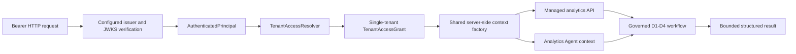

# Trusted Business Analytics Integration (D5)

## Status and boundary

D5 adds a reusable authentication and tenant authorization boundary around the D1-D4 governed workflow. The repository contains a production-suitable RS256/JWKS verifier and configuration-backed grants, but no production issuer, tenant mapping, or delivery paths are configured by default. Until an operator supplies trusted configuration, the managed analytics routes return `503` when a bearer credential is presented and never fall back to anonymous access.



Identity and tenant scope come from the verifier and server-owned mapping. Request JSON, Agent arguments, model output, memory, prompts, generated SQL, and query parameters cannot select a tenant or delivery directory.

## Identity and authorization are separate

`AuthenticatedPrincipal` is immutable and `extra=forbid`. Its fields are `issuer`, `subject`, `audience`, and server-set `authenticated_at`. It has no bearer token, raw JWT, refresh token, password, client secret, or raw claims.

The tuple `(issuer, subject)` identifies a caller. `tenant_id` identifies a business-data partition. The `TenantAccessResolver` maps the exact caller identity to one grant; D5 v1 rejects duplicate mappings and supports one effective tenant per request. A signed `tenant_id`, `roles`, or other arbitrary token claim is ignored.

Agent memory `user_id` remains a separate memory identifier. The authenticated Agent entrypoint derives a stable SHA-256 memory key from issuer and subject, and `AgentGraph` replaces any internal request `user_id` when trusted execution context is present. The generic legacy Agent routes keep their request shape and do not turn their `user_id` into tenant authority.

## Identity verification

The application port accepts a `SecretStr` bearer credential. The HTTP layer extracts the Authorization header; the infrastructure adapter verifies the credential. No username/password store, session login, self-signed production token, OAuth server, `X-User-Id`, or query-string API key was added.

The verifier uses [`PyJWT[crypto]==2.15.0`](https://pypi.org/project/PyJWT/2.15.0/) (MIT) for RS256 signature verification and its [`PyJWKClient`](https://pyjwt.readthedocs.io/en/stable/api.html) adapter. The crypto extra installs [`cryptography`](https://pypi.org/project/cryptography/) (Apache-2.0 OR BSD-3-Clause); its installed [`cffi`](https://pypi.org/project/cffi/) helper is MIT-0. PyJWT 2.15.0 supports the repository's Python 3.11 and 3.12 environments. The single direct dependency is pinned in `backend/requirements.txt`, which Docker, Conda, and CI already consume.

The verifier fixes the allowed algorithm to RS256 and requires exact issuer and audience configuration. It requires `iss`, `sub`, `aud`, and `exp`; it verifies `nbf` and `iat` when present, rejects malformed claims, caps bearer tokens at 8 KiB, and bounds clock skew to 60 seconds (30 seconds by default). Production issuer and JWKS URLs must use HTTPS. JWKS fetch timeout is at most five seconds (two seconds by default); the response cache has a configurable TTL capped at one hour (five minutes by default). Per-key caching is off. Unknown `kid` fails closed. The library's 30-second refresh cooldown starts after every successful fetch, including the initial fetch, so a newly rotated key can be rejected until the cooldown expires; it then refreshes the set. A network failure becomes `503`.

Tests sign local RS256 credentials and serve a local JWKS endpoint only on loopback. They cover valid/invalid signatures, algorithm mismatch, issuer/audience, expiration, not-before, missing or malformed claims, token size, unknown `kid`, key rotation after bounded cache expiry, and JWKS unavailability. Required CI does not call an external issuer.

## Tenant grants and trusted context

The operator-owned grant configuration contains exact `issuer`, `subject`, `tenant_id`, `allowed_datasets`, `contract_name`, and `contract_version` values. Startup loads D2's accepted Contract and rejects unknown datasets, wrong Contract identity, duplicate principal mappings, and mismatched delivery-directory mappings. A second exact mapping assigns each tenant to its delivery directory; these directory values are never derived from request values or tenant string concatenation. The configured directory set must match the grant tenant set, and two tenants cannot share a resolved directory.

The shared `BusinessAnalyticsContextFactory` checks principal/grant consistency, requires a server-generated UUID request ID, and builds the D4 `BusinessAnalyticsContext`. The Agent entrypoint uses the same grant and context plus a server-only `AgentExecutionContext`. Neither trusted context model is part of an HTTP body or model tool schema.

Use environment-backed configuration for deployment. `.env.example` contains only disabled settings and an invalid example issuer. It contains no real subject, tenant mapping, token, private key, or delivery path. If identity or analytics wiring is disabled, routes fail closed. Configuration errors prevent startup when the managed runtime is enabled.

## Authenticated API

`POST /api/v1/business-analytics/query` requires the OpenAPI `BearerAuth` security scheme. Its closed request schema contains only:

- `question`
- `engine`
- `requested_datasets`

Fields such as `tenant_id`, `user_id`, `schema_context`, `delivery_path`, database URL, credentials, policy, timeout, row limit, and contract identity are rejected with `422`. Request validation errors omit submitted values to prevent echoing paths or credential material.

The response DTO explicitly contains request ID, execution status, bounded columns/rows, row count, currency, snapshot freshness, classification, query fingerprint, and Contract version. It does not expose raw SQL, prompts, token usage, delivery path, manifest path, or tenant filesystem data. Stable HTTP outcomes include `401` for missing/invalid bearer, `403` for no grant or denied scope, `422` for invalid/unsafe query input, `409` for delivery integrity mismatch, `503` for unavailable identity/delivery execution, and `504` for D4 deadline expiry.

The existing `/api/v1/text2sql` API is unchanged. Its caller-supplied schema workflow remains generic Text2SQL and is not a managed business-data access boundary.

## Authenticated Agent capability

`POST /api/v1/agent/business-analytics` and `/stream` require the same bearer verification and tenant grant. The deterministic router recognizes the governed SupportOps subjects and keeps schema-only SQL generation, SQL Review, RAG, Warehouse Design, and general chat distinct. A question routed to `BUSINESS_ANALYTICS` without a trusted Agent context returns a safe denial; it does not fall back to generic Text2SQL.

The business tool schema exposes only `question`, `engine`, and `requested_datasets`. The graph injects `AgentExecutionContext` into the adapter at invocation time. Memory may add language context but cannot alter tenant, dataset grants, Contract, policy, or physical delivery. The result formatter is deterministic and shows bounded structured data; the SSE endpoint streams the completed D4 result and does not stream database rows during execution.

## D4 binding and audit

The grant's tenant selects one exact resolver mapping. The independent D4 consumer validates Delivery v2 and tenant equality, materializes only the effective D3 scope into a fresh in-memory DuckDB database, and reauthorizes translated SQL. The physical snapshot remains tenant-scoped. This is not database row-level security (RLS).

D4 audit events add a stable subject fingerprint, opaque grant ID, and trusted `api`, `agent`, or `internal` entrypoint. Audit records still exclude raw token/claims, prompt, SQL, rows, schema, and path. The logging adapter is not a durable compliance ledger. Verified JWT caller identity also does not prove that a SupportOps Delivery producer signed or authenticated its files; producer authenticity remains separate work.

## Deterministic enterprise analytics evaluation

`tests/evaluation/cases/business_analytics_v1.json` is the versioned 50-case golden set. Its synthetic tenant-a and tenant-b deliveries are generated by `tests/fixtures/business_data/generate_evaluation_v1.py`; they contain no customer data or secrets. The suite evaluates routing, authorization allow/deny, SQL AST scope, API auth negatives, and exact DuckDB outputs across order, refund, return, ticket, SLA, event, action, Decimal, enum, boolean, null, join, and timestamp cases.

Run the CI gate with:

```bash
python -m tests.evaluation.run_business_analytics_evaluation
```

The report contains case IDs and pass/fail reasons, never SQL, prompts, tokens, or rows. Gates require routing accuracy of at least 90%; 100% expected grant allow/deny, SQL-scope, answer exact-match, and API-auth-negative accuracy; zero tenant isolation violations; and zero unsafe accepted queries. CI and pytest run entirely offline, and the unchanged repository coverage gate remains 85%.

This deterministic suite evaluates pipeline/security/execution correctness, not live model generation quality. An optional live probe is available at `scripts/evaluate_business_analytics_live.py`; it does nothing unless `DATACOPILOT_EVAL_LIVE_LLM=true`. It reports only case IDs and exact-result match status. It is not required in CI and does not assess explanation faithfulness.

## Current limits and next step

D5 does not configure a real IdP, implement every OIDC provider feature, create a distributed rate limiter, claim RLS, authenticate the SupportOps producer, or complete production deployment. One principal maps to one effective tenant, RS256 is the supported algorithm, and the audit log is not durable. Configure the real issuer, audience, grants, and mounted delivery paths only in the deployment environment, then proceed to **Production Validation P1 — Push / Pull Request / GitHub CI + Real IdP Deployment Validation**. Live LLM evaluation and observability remain later validation work.
